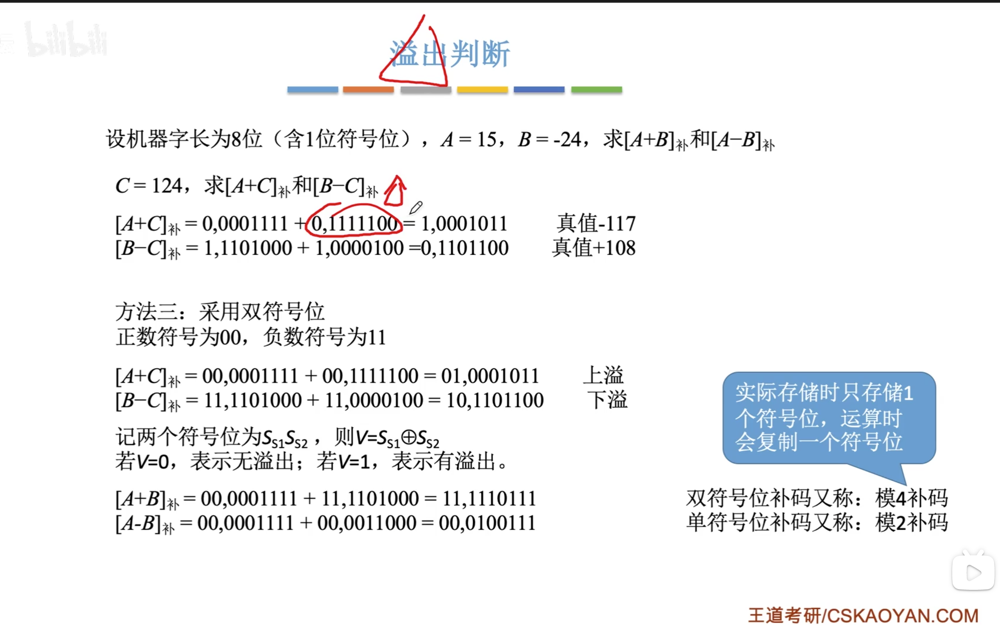
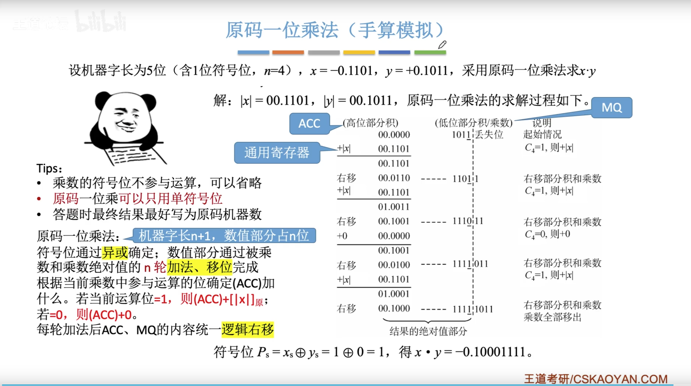
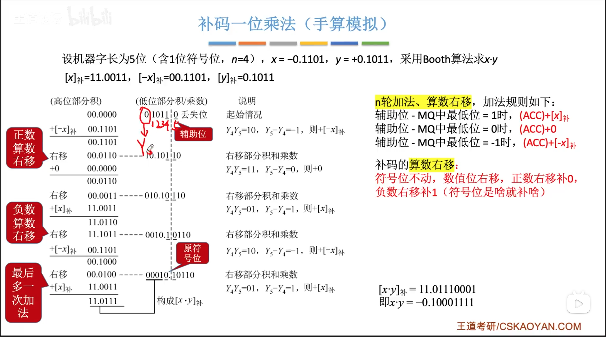
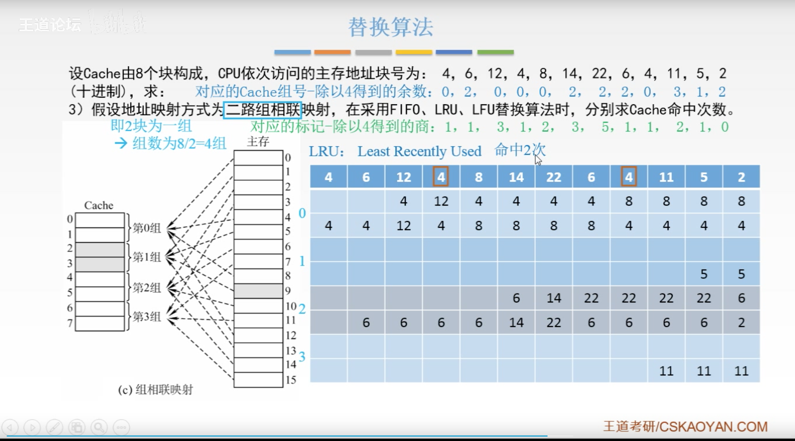

[TOC]
# 计组学习笔记
## 第一章
### 计算机的发展历史
1.计算机发展分为四代，最常见的分代方法是根据计算机所采用的电子器件来划分的。
四代分别为：电子管计算机，晶体管计算机，小、中规模集成电路计算机，大、超大规模集成电路计算机。
2.1971年开始出现了包含CPU的单片集成电路（微处理器），以微处理器为核心的电子计算机就是微型计算机。微型计算机的出现，形成了计算机发展史上的又一次革命，使计算机进入了几乎所有的行业。
3.世界上第一台实现存储程序的计算机是：EDSAC
4.世界上第一台电子数字计算机：EDIAC
5.以冯 诺依曼为首研发的存储程序的计算机为：EDVAC
6.操作系统最先出现在第2代计算机

### 存储程序概念
1.存储程序概念是由冯 诺依曼等人于1945年6月首先提出，简要地概括为以下三点：
> 1.计算机（指硬件）是由运算器，控制器，存储器，输入设备和输出设备五大基本部件组成
> 2.计算机内部采用二进制来表示指令和数据
> 3.将编好的程序和原始数据事先存入存储器中，然后再启动计算机工作，这就是存储程序的基本含义。

冯 诺依曼对世界最大的贡献在于提出了存储程序概念

### 计算机的硬件组成
1.原始的冯 诺依曼计算机在结构上是以运算器为中心，而发展到现在，已转为以存储器为中心
2.通常将运算器和控制器合称为中央处理器（CPU）
3.由中央处理器和主存储器（内存储器）组成主机部分
4.存储器
> 1.存储器是用来存放程序和数据的部件，它是一个记忆装置，是计算机能够实现“存储程序控制”的基础
> 2.在计算机系统中，存储器一般分为三种，高速缓存存储器，主存储器，辅助存储器。
> 主存储器：主存储器可以由CPU直接访问，存取速度快，但是容量小，一般用来存放正在执行的程序和数据。
> 辅助存储器：辅助存储器设置在主机的外部，存取速度慢，但容量大，价格低，一般用来存放暂时不参与运行的程序和数据。CPU不可以直接访问辅存，辅存中存储的程序和数据在被需要时会传送当主存，这时CPU才可以访问到。
> 高速缓存存储器：当CPU速度很高时，为了使访问存储器的速度与CPU的速度匹配，又在主存和CPU之间设置了一个高速缓存存储器，Cache的存取速度比主存更加地快，但是容量更小，一般用于存放当前最急需处理的程序和数据。

5.运算器
> 1.运算器是对信息进行处理和运算的部件。运算器的核心是加法器。

6.控制器
> 1.控制器是整个计算机的指挥中心。控制器从主存中逐条取出指令进行分析，根据指令的不同来安排操作顺序，向各部件发出相应的操作信号，控制它们执行所规定的任务。

7.总线
> 1.所谓总线是一组能为多个部件服务的公共信息传送线路，它能分时地发送与接收各部件的信息。总线的特点就是：分时、共享。
> 2.分时：同一时刻总线只允许一对设备（或部件）之间传送信息
> 3.所谓单总线并不是指只有一根信号线。系统总线按传送信息的不同可以细分为地址总线、数据总线和控制总线。地址总线是由单方向的多根信号线组成，用于CPU向主存、外设传输地址信息；数据总线是由双方向的多根信号线组成，CPU可以沿这些线从主存或外设读入数据，也可以沿这些线向主存或外设送出数据；控制总线上传输的是控制信息，包括CPU送出的控制命令和主存（或外设）返回CPU的反馈信号。

8.程序和数据的存放形式
> 1.冯 诺依曼结构
> 冯 诺依曼结构也称为普林斯顿结构，即指令和数据是不加区别地混合存储在同一个存储器中，共享数据总线。指令地址和数据地址指向同一个存储器的不同物理位置，由于指令和数据存放在同一个存储器中，因此不能同时取指令和取操作数
> 冯 诺依曼机工作方式的特点：按地址访问并顺序执行指令
> 冯 诺依曼机在运算中具有的根本特性是：数据以二进制编码，并采用二进制运算。

> 2.哈佛结构
> 哈佛结构的指令和数据是完全分开的，存储器分为两部分，一个是程序存储器，用来存放指令，一个数据存储器，用来存放数据。因此哈佛结构至少有两条总线

### 计算机系统
1.系列机
> 1.所谓系列机，是指一个厂家生产的，具有相同的系统结构，但具有不同的组成和实现的一系列不同型号的机器

2.软件兼容
> 1.向上（下）兼容：按某档次机器编制的程序，不加修改就能运行在比它更高（低）档的机器上。
> 2.向前（后）兼容：按某个时期投入市场的某种型号机器编制的程序，不加修改就可以运行在它之前（后）投入市场的机器上。
> 对系列机的软件向下和向前兼容可以不作要求，但必须保证向后兼容，力争做到向上兼容。

3.硬件和软件
> 1.从设计者角度，硬件和软件之间的界面是操作系统。
> 2.对计算机的软、硬件资源进行管理是由操作系统完成的。

### 计算机的工作过程和主要性能指标
1.程序
> 程序是一个特定的指令序列，它告诉计算机要做哪些事，按什么步骤去做。

2.指令
> 指令是一组二进制信息的代码，用来表示计算机所能完成的基本操作

3.编制好的程序放在主存中，由控制器控制逐条取出指令执行

4.计算机的主要性能指标
>1.机器字长：机器字长是指参与运算的数的基本位数，它是由加法器、寄存器的位数决定的，所以机器字长一般等于内部寄存器的大小。字长标志着精度，字长越长，计算的精度就越高。
>2.数据通路宽度：数据总线一次所能并行传送信息的位数。它影响着信息的传送能力，从而影响计算机的有效处理速度。
>3.主存容量：一个主存储器所能存储的全部信息量。1024个字节称为1KB，1024KB个字节称为1MB，1024MB字节称为1GB。
>4.吞吐量：是指系统在单位时间内处理请求的数量。
>5.主频：CPU的主频是CPU时钟周期的倒数。
>6.CPI：每条指令执行所需要的时钟周期数。
>7.IPC：每个时钟周期执行的指令书。
>8.MIPS：表示每秒执行多少百万条指令。
>9.MFLOPS：表示每秒执行多少百万次点运算。适用于衡量向量机的性能。

## 第二章
### 数值数据的表示
1.后缀B表示二进制，后缀Q表示八进制，后缀D表示十进制，后缀H表示十六进制。在C语言中，八进制常数以前缀0开始，十六进制常数以前缀0x开始。
2.在有符号数中，最高位0表示正数，若最高位为1表示负数。

### 原码表示法
最高位为符号位©️，符号位为0时表示该数为正，符号位为1时表示该数为负，数值部分与真值相同。
原码表示法的优点是直观易懂，机器数和真值间的相互转换很容易，用原码实现乘、除运算的规则很简单；缺点是实现加、减运算的规则较复杂。

### 补码表示法
1.补码的符号位表示法与原码相同，其数值部分的表示与数的正负有关；对于正数，数值部分与真值形式相同；对于负数，将真值的数值部分按位取反，且在最低位上加1。
2.在补码表示中，真值0的表示形式是唯一的。+0和-0的补码表示都为00000。
3.设计补码的目的是：
    1.使符号位能够参与运算
    2.进行算术运算时，可以使减法运算转化为加法运算，从而简化机器的运算器电路。

### 反码表示法
对于正数，数值部分与真值相同；对于负数，将真值的数值部分按位取反。

### 3种机器数的比较
1.最高位都表示符号位：补码和反码的符号位可看作数值位的一部分看待，和数值位一起参与运算；但原码的符号位不允许和数值位同等看待，必须分开处理。
2.对于真值0（+0和-0），原码和反码有两种不同的表示形式，而补码只有唯一的一种表示形式。
3.原码、反码表示的正、负数范围相对零来说是对称的；但补码负数表示范围较正数表示范围宽，能多表示一个最负的数，值为-2^n或者-1

### 机器数的定点表示与浮点表示
#### 定点表示法
##### 定点小数
定点小数即纯小数，小数点固定在最高有效数位之前、符号位之后。

##### 定点整数
定点整数即纯整数，小数点位置隐含固定在最低位有效数位之后。

#### 浮点表示法
1.浮点数一般由三部分组成：尾数，基数，阶码，在大多数计算机中，尾数为纯小数，一般用原码或补码表示；阶码为纯整数，一般用补码或移码表示。
2.浮点数的表示范围主要由阶码的位数来决定，有效数字的精度主要由尾数的位数来决定。

#### 规格化浮点数
1.规格化浮点数，即规定尾数的最高数位必须是一个有效值。
2.规格化浮点数的尾数M的绝对值应在下列范围内：1/r <= |M| < 1 (r是基数），M有两种取值范围：r=2时，1/2 <= M < 1 或者 -1 <= M < -1/2 （注意⚠️：当尾数为负时，-1/2是取不到的）
3.r = 2 时， M= -1/2 ，对于原码来说这是一个规格化数，但是对于补码来说这不是一个规格化数，M = -1， 对于原码来说这不是一个规格化数，但对于补码来说这是一个规格化数。

4.对于上溢，计算机必须中止运算操作，进行溢出处理；对于下溢，计算机一般不作任何处理，仅置换成机器零即🉑️。

5.浮点数的尾数为0，不论阶码为何值，一般也作为机器零处理。而机器零的标准格式为：尾数为0，阶码为最小值（绝对值最大负数）。

#### 浮点数阶码的移码表示法
1.移码就是在真值X（注意是真值X，不是原码）基础上再加一个常数，而这个常数被称为偏置值。
2.在移码中，最高位0表示负数，最高位1表示正数，这与原码、补码以及反码的符号位取值正好相反。
3.移码全为0时，它所对应的真值最小；全为1时，所对应的真值最大。因此，移码的大小直观地反映了真值的大小，这将有助于两个浮点数进行阶码的大小比较。
4.真值0在移码中的表示形式也是唯一的，即+0和-0的移码表示都是一样的。
5.移码把真值映射到一个正数域，所以可将移码视为无符号数，直接按无符号数规则比较大小。
6.同一数值的移码和补码除最高位相反外，其他各位相同。

#### IEEE754标准浮点数
1.按IEEE754标准，常用的浮点数的格式为：
数符；阶码（用移码表示）：尾数（用原码表示）
2.对于32位的短浮点数，阶码的偏置值为127；而对于规格化的浮点数，数值的最高位总是1，为了能使尾数多表示一位有效值，可将这个1隐含，因此尾数数值实际上是24位（隐含了最高位1）

### 十进制数和数串的表示
#### 8421码
1.8421码又称为自然BCD码，简称NBCD码。
2.8421码只用来表示十进制数0～9
3.在8421码中，不允许出现1010～1111

#### 2421码
1.它是一种对于9的自补码，即某数的2421码，只要按位取反，就能得到该数对9补数的2421码。
2.不允许出现0101～1010这6个代码。

#### 余3码
1.余3码是在8421码的基础上加0011形成的。
2.不允许出现0000～0010 和 1101 ～ 1111

### 数据校验码
#### 奇偶校验码
1.奇偶校验码可以检测一位错误，但不能确定出错的位置。
2.奇偶检验码是：奇偶校验位 + 有效信息位。
3.奇校验：整个校验码中1的个数是奇数；偶校验即1的个数为偶数。
4.简单奇偶校验码只能实现横向的奇偶校验。

#### 交叉奇偶校验码

#### 汉明校验码
1.汉明码实际上是一种多重奇偶校验。
2.校验码的位数K和信息位的位数N满足 N + K + 1 <= 2^(K-1)
3.每个校验位pi在汉明码中被分到位号2^(i-1)的位置上。

#### 循环冗余校验码（CRC）
1.信息位 + 校验位 = 校验码。
2.多项式G（X）的位数 - 1，比如多项式G（X）的位数为6，那么校验位的位数就为5，然后补5个0到信息位的后面，然后用信息位去除多项式（除的规则是：异或原则）

### 算术左右移，逻辑左右移
1.逻辑左移：最高位丢失，低位补0.
2.逻辑右移：最低位丢失，高位补0.
3.算术左移：符号位保持不变，依次左移，低位补0.
4.算术右移：符号位保持不变，依次右移，高位补符号位。

## 第三章

## 第四章
### 基本算术运算的实现
1.计算机中最基本的算术运算是加法运算，加、减、乘、除运算最终都可以归结为加法运算。

#### 加法器
1.加法器是由全加器再配以其他必要的逻辑电路组成的。
2.加法器有串行和并行之分。在串行加法器中，只有一个全加器，数据逐位串行送入加法器进行运算；并行加法器则有多个全加器组成，数据的各位同时运算。
3.串行进位的并行加法器：每一级进位直接依赖于前一级的进位，即进位信号是逐级形成的。串行进位的并行加法器的总延迟时间与字长成正比，字长越长，则总延迟时间越长。
4.并行进位的并行加法器：所有的进位输出不依赖于其低位的进位输入。进位输出仅由Gi，Pi及最低进位输入C0决定

#### 全加器
全加器是最基本的加法单元，它🈶️3个输入量：两个操作数和低位传来的进位，两个输出量：本位和向高位的进位。

### 定点加减运算
#### 原码加减运算

#### 补码加减运算

对于补码来说，无论加法还是减法，最后都会转变成加法，由加法器实现运算，符号位也参与运算

#### 溢出判断

#### 符号扩展

#### 移位规则

1.原码的移位规则：不管是正数还是负数，在左移或右移时，符号位不变，空出位一律以“0”补入。

2.补码的移位规则：不管是正数还是负数，在左移或右移时，符号位不变，空出位一律以符号位补入。

#### 定点乘法运算

##### 原码一位乘法

运算器的基本组成

原码一位乘法

##### 补码一位乘法

#### 定点除法运算

##### 手算除法

##### 恢复余数法

#### 不恢复余数法

#### 补码除法

最后不需要管余数是否正负

3

#### 浮点数的加减运算

十进制数的加减计算

浮点数的加减计算

### 运算器的基本组成与实例

1.运算器是在控制器的控制下实现其功能的。运算器不仅可以完成数据信息的算术逻辑运算，还可以作为数据信息的传送通路。

2.运算器的基本组成：基本的运算器包含以下几个部分：实现基本算术、逻辑运算功能的ALU，提供操作数与暂存结果的寄存器组，有关的判别逻辑和控制电路等。

3.运算器内部的各功能模块之间的连接也广泛采用总线结构，运算器内部总线是CPU的内部数据通路，因此只有数据线。

4.运算器内部根据如何将操作数送入ALU，将运算器分为两种

​	1.带多路选择器的运算器

​	2.带输入锁存器的运算器

## 第五章

#### 存储系统的组成

1.存储系统是由几个容量、速度和价格各不相同的存储器构成的系统。

按存储器在计算机系统中的作用分类：
	1.高速缓存存储器

​	2.主存储器

​	3.辅助存储器

按存取方式分类：
	1.随机存取存储器（RAM）

​	2.只读存储器（ROM）

​	3.顺序存取存储器（SAM）

​	4.直接存取存储器（DAM）

SAM 和 DAM 的存取时间都与存储体的物理位置有关，所以又可以把它们统称为串行访问存储器。

按存储介质分类：

​	1.磁芯存储器

​		磁芯存储器采用两种不同的剩磁状态来表示1或0，一颗磁芯存放一个二进制位，成千上万颗磁芯组成磁芯体，磁芯存储器的特点是信息可以长期存储，不会因断点而丢失，但磁芯存储器的读出是破坏性读出的，即不论磁芯原存的内容为“0”还是“1”，读出之后磁芯的内容都变为“0”，因此需要再重写一次。

​	2.半导体存储器

​		采用半导体器件制造的存储器，主要有MOS型存储器和双极型（TTL电路或ECL电路）存储器两类。半导体RAM存储器会因断电而导致信息丢失。

​	3.磁表面存储器

​		在金属或塑料基体上，涂覆一层磁性材料，用磁层存储信息。多用作辅助存储器。

​	4.光存储器

​		采用激光技术控制访问的存储器，它们的存储容量都很大，是目前使用非常广泛的辅助存储器。

按信息的可保存行分类

​	1.易失性存储器

​		断电后存储信息即消失的存储器。

​	2.非易失性存储区

#### 存储系统层次结构

1.由高速缓冲存储器、主存储器和辅助存储器构成的三级存储系统可以分为两个层次，其中高速缓存和主存间称为Cache-主存存储层次（Cache存储系统）；主存和辅存间称为主存-辅存存储层次（虚拟存储系统）。

2.Cache存储系统是为了解决主存速度不足而提出的，虚拟存储系统是为了解决主存容量不足提出的。

#### 主存储器的组织

1.主存储器是整个存储系统的核心，通常由存储体，IO和读写电路，地址译码驱动电路组成。

2.存储体是存储器的核心，程序和数据哦度存放在存储体上。

3.地址译码驱动电路实际上包含译码器和驱动器两部分。译码器将地址总线输入的地址码转换称与之对应的译码输出线上的有效电平，以表示选中了某一存储单元，然后由驱动器提供驱动电流去驱动相应的读写电路，完成对被选中存储单元的读写操作。

4.I/O和读写电路包括读出放大器、写入电路和读写控制电路，用以完成被选中存储单元中各位的读出和写入操作。

5.主存的读写操作是在控制器的控制下进行的，只有接收到来自控制器的读写命令或写允许信号后，才能实现正确的读写操作。

6.位是二进制数的最基本单位，也是存储器存储信息的最小单位。一个二进制数由若干位组成，当这个二进制数作为一个整体存入或取出时，这个数称为存储字。存放存储字或存储字节的主存空间称为存储单元或主存单元。存储单元的编号称为地址。存储单元是CPU对主存可访问操作的最小存储单位。

7.大端方案：字地址等于最高有效字节地址，且字地址总是等于4的整数倍。

​	小端方案：字地址等于最低有效字节地址，且字地址总是等于2的整数倍。

8.主存储器的主要技术指标

> 1.存储容量
>
> ​	对于字节编址的计算机，以字节数来表示存储容量；对于字编址的计算机，以字数与其字长的乘积来表示存储容量。
>
> 2.存取速度
>
> ​	1.存取时间Ta
>
> ​	2.存取周期Tm，一般情况下Tm > Ta ，因为对于任何一种存储器，在读写操作之后，总要有一段恢复内部状态的复原时间。
>
> ​	3.主存带宽Bm：表示每秒从主存进出信息的最大数量，单位以字每秒或字节每秒或位每秒。
>
> ​	目前，主存提供信息的速度还跟不上CPU处理指令和数据的速度，所以，主存的带宽是改善计算机系统瓶颈的一个关键因素。为了提高主存的带宽，可以采取的措施有：缩短存储周期，增加存储字长，增加存储体。
>
> 3.可靠性
>
> ​	可靠性是指在规定的时间内，存储器无故障读写的概率。
>
> 4.功耗

高速缓冲存储器

