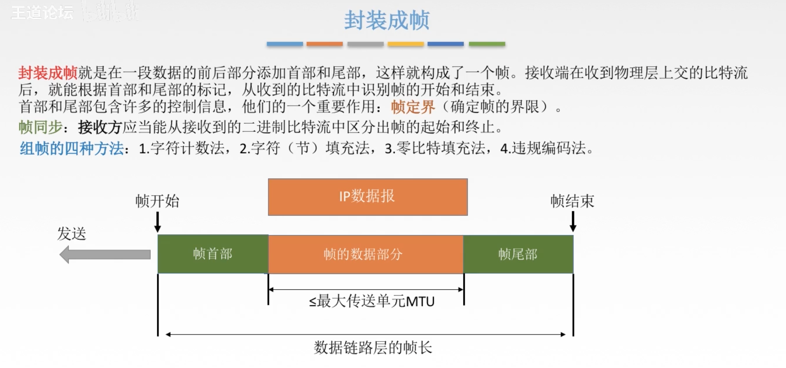

* [ ] 

# 计网笔记

[TOC]

# 第一章

## 概念

- 计算机网络，是一个将分散的，具有独立的`计算机系统`，通过`通信设备`和`线路`连接起来，由功能完善的`软件`实现`资源共享`和`信息传递`的系统
- 计算机网络 是 互联，自治的计算机集合
  - 互联是指 互联互通
  - 自治是指 没有主从关系

## 功能

- 数据通信
- 资源共享 - 硬件 软件 数据
- 分布式处理——多台计算机各自承担同一工作任务的不同部分
- 提高可靠性
- 负载均衡 各台计算机一起工作

## 组成

- 组成部分——硬件，软件，协议
- 工作方式
  - 边缘部分 —— 用户直接使用 （通过客户端方式（C/S方式）或者P2P方式）
  - 核心部分 为边缘部分服务 （核心部分里主要是网络和路由器）
- 功能组成
  - 通信子网 实现数据通信（网络层，数据链路层，物理层）
  - 资源子网 实现资源共享/数据处理（应用层）

## 分类

- 按分布范围分 - 广域网WAN，城域网MAN，局域网WAN，个人区域网PAN
- 按使用者分为公用网（移动，电信，联通之类的），和专用网（军队）
- 按交换技术分为 电路交换，报文交换，分组交换
- 按拓扑结构分为 总线型，星型，环型，以及网状型（一般用在广域网，目前的因特网用的就是网状型）
- 按传输技术分为 广播式网络（共享公共通信信道，网络上每一台主机都收到传送的信息，自己判断是否发给自己的对信息进行处理或者丢弃），点对点网络（使用`分组存储转发`和`路由选择`机制）

## 速率

- `速率`就是`数据率`或`称数据传输率`或`比特率`
- 基本单位为b/s 称为 比特每秒

## 存储容量

- 1字节为8个比特

## 带宽

`带宽`用来表示网络的通信线路传送数据的能力，通常是指单位时间内从网络中的某一点到另一点所能通过的“最高数据率”，单位为 比特每秒 b/s

- 比如链路的带宽为 1b/s,那么1秒内发送端可以发送1比特的数据
- 如果链路的带宽变为2b/s,那么1秒内发送端可以发送2比特的数据

## 吞吐量

- 表示在单位时间内通过某个网络（或信道，或接口）的数据量，单位b/s,kb/s,Mb/s
- 带宽是理想情况下发送端在单位时间内发出的最大数据量，而吞吐量是在实际情况下发送端在单位时间内发出的最大数据量

## 时延

- 指数据（报文/分组/比特流）从网络（或链路）的一端传送到另一端所需的时间，也叫`延迟`或`迟延`。单位是`s`
- 时延有四部分，包括 发送时延，传播时延，排队时延，和处理时延四部分
- 发送时延 = 数据长度/信道带宽（发送速率） 在主机内部的（将数据发送到信道上）
- 传播时延 取决于电磁皮传播速度和链路长度 = 信道长度/电磁波在信道上的传播速率（在链路上传输数据时，会对数据进行处理之后以电磁波为载体来传输数据）
- 排队时延 等待输出/入链路可用
- 处理时延 检错找出口（另一端收到数据之后对数据进行检测看是否有出错，若没有则对数据进行处理 自己接受或者继续传递给下一个端口）
- 高速链路改变的是信道带宽，减少了发送时延，但对其他时延 几乎没有影响

## 时延带宽积

- 时延带宽积 = 传播时延 X 带宽，可以理解为“当前链路可以最多传输多少比特的数据”，——链路的容量

## 往返时延RTT

- 从发送方发送数据开始，到发送方收到接收方的确认（接收方收到数据后立马发送确认）总共经历的时延
- RTT越大，在收到确认之前，可以发送的数据越多
- RTT包括 1 往返传播时延 *2 +  末端处理时间

## 利用率

- 包括两种 信道利用率 和 网络利用率
-  信道利用率 = 有数据在链路上通过的时间 / (有 加 无)数据在链路上的时间 —— 信道利用率越大，那么时延也就会越大
- 网络利用率 信道利用率加权平均值

## 认识分层结构

- 实体

  > 第n层中的活动元素成为n层实体，同一层的实体叫做对等实体

- 协议

  > 为进行网络中的`对等实体`数据交换而建立的规则，标准或约定称为网络协议

- 接口

  > 上层使用下层服务的接口

- 服务

  > 下层为相邻上层提供的功能调用，第n层向n+1层提供服务时，此服务不仅包括第n层本身的功能，还包含由下层提供的服务

## 计算机网络层次划分

### OSI模型——ISO国际标准化定义的

- 分为应用层，表示层，会话层，传输层，网络层，数据链路层，物理层，前面三层划分为 资源子网 后面四层划分为 通信子网 
- 应用层，表示层，会话层，输出层这四层是端到端的（发送端到接收端的，中间经过的运输介质，比如路由器 交换机 集线器 是没有这四层的）
- 网络层，数据链路层和物理层是点到点的，端到端是明确了发送的端口以及最后接受的端口，点到点是根据最后接收的端口确定的下一个要发往的站点

从主机A到主机B的通信其实就类似于一个打包和拆包的过程

1.主机A要发送的信息DATA在应用层包装之后发送下一层-表示层

2.表示层的数据再进行包装发送到下一层会话层

3.每一层都根据自己这一层的协议进行包装数据

4.最后到了物理层，物理层是一个傻瓜层，不会对数据进行处理，只是把数据放在介质上传输

当主机B收到这个数据

1.从数据链路层开始根据每一层的协议对收到的数据进行解析（拆包）

2.最后经过应用层之后只拆剩下DATA数据

3.这个DATA数据就是当时主机A传输的信息

### OSI每一层的细分

- 应用层

  > 所有能与用户交互产生网络流量的程序（是要联网的，像记事本那种本地的不算）

- 表示层

  > 用于处理在两个通信系统中交换信息的表示方式（语法和语义）
  >
  > 功能1:数据格式变换（比如在电脑发一条信息到手机，由于格式不一样要进行转换）
  >
  > 功能2:数据加密解密
  >
  > 功能3:数据压缩和恢复

- 会话层

  > 向表示层实体/用户进程提供建立连接并在连接上有序地传输数据。这是会话，也是建立同步
  >
  > 功能1:建立，管理，终止会话
  >
  > 功能2:使用校验点可使会话在通信失效时从校验点/同步点继续恢复通信，实现数据同步——适用于传输大文件（比如把一个大文件分成了三部分转发，当最后一部分转发失败，可以利用校验点转发第三部分，而不是全部重新发）

- 传输层（主要用到的协议有TCP，UDP）

  > 负责主机中两个进程的通信，即端到端的通信。传输单位是报文段或用户数据报
  >
  > 功能
  >
  > 1.可靠传输，不可靠传输
  >
  > > 可靠传输是基于确认机制的，主机A发送一个文件到主机B，这个文件在主机A那经过处理会被分解成很多的报文段发送到主机B，当主机B收到一个报文段之后会给主机A发送一个确认，这样主机A才会发送下一个报文段
  >
  > > 不可靠传输是不用基于确认机制的，不用建议连接，就是不管对方是否收到，直接把全部报文段发出去——对小数据可以采用不可靠传输
  >
  > 2.差错控制
  >
  > > 要发送的报文段，如果发生了错误，那么传输层负责对报文进行修正
  >
  > 3.流量控制
  >
  > > 控制自己发送报文段的速率
  >
  > 4.复用分用
  >
  > > 复用：多个应用层进程可同时使用运输层的服务
  > >
  > > 分用：运输层把收到的信息分别交付给上面应用层中相应的应用
  > >
  > > 比如：手机A中同时登录了QQ和微信，那么久存在了两个进程，这台手机上的QQ和微信同时发信息到手机B上的QQ和微信，那么A中的QQ和微信的信息同时在运输层传递（复用），到了手机B中，把收到的信息分别交付到对应的应用（分用）

- 网络层（只要用到的协议有：IP，IPX，ICMP，IGMP，ARP，RARP，OSPF）

  > 主要任务把`分组`从源端传到目的端，为分组交换网上的不同主机提供通信服务。
  >
  > 网络层的传输单位是`数据报`
  >
  > 数据报跟分组其实是父与子的关系，当数据报非常大的时候，会将数据报分割成一个个分组，然后传输分组
  >
  > 功能
  >
  > 1:路由控制：根据算法选出传输分组的最佳路径
  >
  > 2:流量控制：协调发送端和接收端之间的传输速度，比如发送端发送太快，接收端接收不了，那么发送端就会把速度降下来
  >
  > 3:差错控制：根据一些规则（比如奇偶校验）对收到的分组进行校验，如果发现有错误，自己能改的话就修改，不能的话就把该分组丢弃
  >
  > 4:拥塞控制： 流量控制是针对于发送端的，拥塞控制是针对于全局的。——若所有结点都来不及接受分组，而要丢弃大量分组的话，网络就处于拥塞状态，因此要采取一定措施来缓解这种拥塞

- 数据链路层

  > 主要任务是把网络层传下来的数据报组装成`帧`
  >
  > 数据链路层的传输单位是`帧`
  >
  > 功能
  >
  > 1:成帧（定义帧的开始和结束）根据一些规则将数据报的首尾部进行组装帧
  >
  > 2:差错控制：对数据进行检错和纠错
  >
  > 3:流量控制：针对发送方的发送速度
  >
  > 4:访问（接入）控制：控制对信道的访问——在广播式网络中，只能有一台主机占用信道发送信息，其他连接在该信道上的主机只能监听收到的信息，那么这时就需要链路层就控制哪台主机可以对信道有访问权限

- 物理层（傻瓜层）

  > 主要任务是在物理媒体上实现比特流的透明传输——将比特流转成电信号的信息在链路上进行传输，不对数据有加工处理
  >
  > - 透明传输：指不管所传数据是什么样的比特组合，都应当能够在链路上传送
  >
  > 功能
  >
  > 1：定义接口特性：定义接口需要多个引脚连接之类的
  >
  > 2：定义传输模式：单工，半双工，双工
  >
  > 单工：确定了发送方和接收方，没得改变
  >
  > 半双工：都可以当发送方，但同一时间只有一个可以发送信息
  >
  > 双工：都可以当发送方，也可以同时通话
  >
  > 3：定义传输速率：定义速率为10兆，百兆之类
  >
  > 4：比特同步：这边发送一个1，接收方接收到一个1
  >
  > 5：比特编码：定义用什么来表示比特0，比特1

### TCP/IP参考模型

OSI参考模型是先理论再实践

TCP/IP参考模型是先实践再理论

- TCP/IP参考模型有四层：应用层，传输层，网际层，网络接口层

与OSI参考模型的相同点：

1.都分层

2.基于独立的协议栈的概念（每一层都对应遵守的协议）

3.可以实现异构网络互联（不同厂家生产的计算机都可以通信）

与OSI参考模型的不同点：

1.OSI定义了三点：服务，协议，接口

2.OSI先出现，参考模型先于协议发明，而TCP/IP是根据要实现的协议去定义参考模型

3.TCP/IP设计之初就考虑到异构网互联问题，将IP作为重要层次

4.

在网络层IP协议强调的是无连接，传输层作用是实现端到端的通信，强调的是面向连接

### 5层参考模型

- 网络层，传输层，网络层，数据链路层，物理层

## 第一章总结

# 第二章

##  物理层

### 概述

- 简单来说 就是我们看得见摸得着的东西  ——物理层考虑的是怎样才能在连接各种计算机的传输媒体上传输数据比特流，它的作用是尽可能屏蔽传输媒体和通信手段的差异，使到数据链路层感觉不到差异

> 物理层主要任务 —— 确定与传输媒体接口有关的一些特性（定义标准）
>
> 1.机械特性——定义物理连接的特性，规定物理连接时所采用的规格，接口形状，引线数目，引脚数量和排列情况
>
> 2.电气特性——规定传输二进制位时，线路上信号的电压范围，阻抗匹配，传输速率和距离限制等（比如某网络在物理层上，10V到15V表示二进制0，其他表示二进制1）
>
> 3.功能特性——指明某条线上出现的某一电平表示何种意义，接口部件的信号线的用途
>
> 4.规程特性——过程——定义各条物理线路的工作规程和时序关系等

### 数据：传送信息的实体，通常是有意义的符号序列

### 信号：数据的电气/电磁的表现，是数据在传输过程汇总的`存在形式`

> 分为数字信号和模拟信号
>
> 数字信号：代表消息的参数取值是离散的
>
> 模拟信号：代表消息的参数取值是连续的

### 信源：产生和发送数据的源头

### 信宿：接收数据的终点

### 信道 - 用来表示向某一个方向传送信息的媒体，一条通信电路往往包含一条发送信道和一条接收信道

> 信道按传输信号可以分为 模拟信道 和 数字信道
>
> 按传输介质可以分为 无线信道 和 有线信道

### 单工通信 ， 半双工通信，全双工通信

### 基带信号 - 来自信源的信号

### 双绞线

### 光纤 - 传输媒体

### 传输方式

> 有两种传输方式：串行传输和并行传输
>
> 1.串行传输：速度慢，成本低，适合远距离
>
> 2.并行传输：速度快，成本高，适合近距离（要同时开辟多条信道传输数据）

### 码元

> 码元是指用一个固定时长的信号波形（数字脉冲），代表不同离散数值的基本波形（说白了，码元就是信号，信号0，信号1之类的），是数字通信中数字信号计量单位，这个时长内的信号称为k进制码元，而该时长称为码元宽度，当码元的离散状态有M个时，此时码元为M进制码元
>
> 1个码元可以携带多个比特的信息量，比如在四进制码元中 信号分别有00，01，10，11，那么一个码元就携带了两个比特的信息

### 速率

> 速率也叫数据率，是指数据的传输速率，表示单位时间内传输的数据量，可以用码元传输速率和信息传输速率表示
>
> 要注意的是：传输速率和传播速率是不一样的
>
> 传输速率是在主机上讲数据发送到信道
>
> 传播速度是数据在整个链路上的传输

### 码元传输速率 1s可以传输多少个码元

- 单位是波特（Baud）

### 信息传输速率 1s可以传输多少个比特

> 系统传输的是比特流，一般比较系统的传输速率用的是信息传输速率

### 信道复用 - 频分复用 - 时分复用 - 波分复用 - 码分复用（传输不同的码型，来避免干扰）

### 失真

- 影响失真程度的因素中 前面 3 种是正相关，最后一种是负相关

### 码间串扰

- 信道包括模拟信道和数字信道。在模拟信道上，带宽为最高频率和最低频率之差。在数字信道上，带宽为信道能够能够达到的最大速率

- 码间串扰——其实就是接收端接收到信号时 无法 判断这个信号到底是0信号还是1信号

### 柰氏准则和香农定理

- 为了避免码间串扰，柰氏准则是规定了码元的最高传输速率
- 香农定理对信息传输速率有了最高的限制，而且也考虑到了噪声的情况，柰氏准则是在无噪声情况下制定的

### 基带信号和宽带信号

- 基带信号就是直接发出要传输的信号
- 而宽带信号就是将原来的信号调整之后再进行传输

### 编码与调制

- 将数据转换为信号 就需要进行编码和调制

#### 数字数据编码为数字信号

有多种方式

1.非归零编码——就是1为高电平，0为低电平的编码——这种编码容易实现，但是没有检错功能，无法判断一个码元的开始和结束，以至于收发双方难以保持同步（比如发送方发了很长一串1过去，接收方收到之后无法判断这里有多少个1，那么发送方需要在另外一条信道上告诉接收方这个信号的周期是多少，那么接收方才能计算出有多少个1）

2.归零编码——信号电平在一个码元之内都要恢复到零的编码

3.反向不归零编码——信号电平翻转表示0，信号电平不变表示1

4.曼彻斯特编码——将一个码元分成两个相等的间隔，前一个间隔为低电平后一个间隔为高电平表示码元1；码元0则正好相反，也可采用相反的规定

5.差分曼彻斯特编码——若码元为1，则前半个码元的电平与上一个码元的后半个码元的电平相同，若为0，则相反

6.4B/5B编码 在要传输的比特流中插入额外的比特来打破一连串的0或1，就是用5个比特的编码来表示4个比特的数据，然后传给接收方，接收方收到数据之后再对数据进行处理

#### 数字数据调制为模拟信号

- 数字数据经过调制器之后可以转换为模拟信号

#### 模拟数据编码为数字信号

- 将一大串连续的数据转换为离散的数据值

- 最高保真的编码方式是PCM——这种编码的采样频率>=两倍的信号最高频率

- PCM最主要的三步——抽样，量化，和编码

  > 抽样是将连续的数据抽取样点，取出离散的数据
  >
  > 量化是将取出的离散数据进行数值转换，比如将5.2V的转换为5V
  >
  > 编码是将量化的结果转换为对应的二进制编码

#### 模拟数据调制为模拟信号

#### 调制与编码总结

### 物理层传输介质

- 传输介质也称为传输媒体/传输媒介，它就是数据传输系统中在发送设备和接收设备之间的物理通路
- 传输媒体并不是物理层，在传输媒体中传输的信号，但是传输媒体并不知道这些信号是什么信号，而物理层规定了电气特性，可以根据电压之类的值去识别所传送的比特流

- 双绞线

- 同轴电缆

- 光纤

- 光纤里传输的是光脉冲，双绞线和同轴电缆里传输的是电磁波

#### 非导向性传输介质

### 物理层设备

- 信号在线路上传输时会有损耗，衰减到一定程度就会造成信号失真，因此会导致接收错误。那么为了防止发生这样的错误，我们可以利用中继器堆信号进行再生和还原

- 但是中继器对信号的再生和还原是消耗时间的，因此存在着一个5-4-3规则

  > 5表示最多只能有5个网段
  >
  > 4表示最多只能有4个中继器
  >
  > 3表示最多只能有3台主机连在上面

### 集线器（多口中继器）

- 中继器是只有两个端口的，而集线器里有多个端口

- 集线器也是可以对信号进行再生和放大

- 集线器收到信号之后，对信号进行再生和放大，然后向其他端口都转发这个信号，它是不具备定向传送能力的，是一个共享设备

- 集线器还能扩大信号传输距离

  > 比如主机A到集线器的距离为100m，主机B到集线器的距离也是100m
  >
  > 那么主机A将信号发送到集线器，集线器可以将信号转到其他端口上，包括主机B，那么信号的传输距离就从100m变成200m了

- 集线器在同一时间内只能实现一个通信——只能再生和转发一个信号，这样就很容易产生冲突，当主机A和主机B同时向集线器发送信号时，就会产生冲突，而产生冲突后，经过随机的时间，主机A和主机B会再次发送信号到集线器

- 集线器就是一个大的冲突域，但是它不能分割冲突域

- 为了减少冲突，连在集线器上的工作主机要平分带宽

  > 比如集线器的带宽为10兆/s，共有5台工作主机连在上面，那么每台主机平分到的带宽为2兆/s

### 物理层总结

# 第三章

## 数据链路层

### 基本概念

- 链路是物理通道
- 数据链路是逻辑通道

### 功能概述

- 数据链路层会考虑到物理层传输数据时可能发生的错误，然后自己做好防错处理——将物理层提供的可能出错的物理连接改造成为辑上无差错的数据链路

- 无确认无连接服务——源主机在发送信息之前不需要跟目的主机建立连接，目的主机收到信息之后也不需回复确认信息
- 有确认无连接服务——源主机在发送信息之前不需要跟目的主机建立连接，目的主机收到信息之后要回复确认信息
- 有确认有连接服务——源主机在发送信息之间要跟目的主机建立连接，目的主机收到信息之后要回复确认信息

### 封装成帧

- 这是在发送方做完的。——在网络层传下来的IP数据报的前后部分添加首部和尾部，这样就构成了一个帧。而接收端在收到物理层上交的比特流后，就能根据首部和尾部的标记，从收到的比特流中识别帧的开始和结束
- 首部和尾部包含许多的控制信息，他们中的一个重要作用时：帧定界（确定 帧的界限）

### 帧同步

- 这是在接收端实现的。接收方能够从接收到的二进制比特流中区分出帧的起始和终止

### 字符计数法

- 不好的地方是如果帧首部的第一个字节发生了错误，那么会导致这一串比特流都识别出错

### 字符填充法

- 帧的首部和尾部确定一组比特流来让识别出这是帧的开始和结束

- 原始数据可以理解为网络层传下来的IP数据报，首先利用字符填充法在数据报的首部和尾部添加特定字符来识别出该帧。然后在数据报里面如果存在其他信息会影响到帧的识别，那么就会要该信息前加上ESC，当接收方收到信息时，会识别出帧，然后将帧中的转义字符ESC丢掉，然后正确地拿出传输的原始数据

### 零比特填充法

- 规则 5 1 1 0
- 在发送端接收到的IP数据报组装成帧 帧的首部和尾部都 0111110，然后如果数据部分出现了5个1，那么就在后面填多1个0
- 在接收端接收到的数据，首先识别出帧的首部，然后在扫描数据部分时，将连续出现5个1后面的那一个0删除，最后成功地提取出原始的数据部分

### 违规编码法

- 比特流常见的编码方式为曼彻斯特编码，里面只会存在高低或者低高来表示一个信号，那么我们就可以用高高或者低低来作为定界帧的起始和终止

### 透明传输

- 不管所传数据是什么样的比特组合，都应当能够在链路上传送。因此，链路层是“看不见”有什么妨碍数据传输的东西

### 差错控制（检错编码）

- 传输中的差错是由于噪声引起的
- 全局噪声：线路本身电气特性所产生的随机噪声（热噪声），是信道固有的，随机存在的
- 局部噪声：外界特定的短暂原因所造成的冲击噪声（比如我们去拍打链路），这是产生差错的主要原因
- 差错包括位错和帧错
- 对于通信质量好的有线传输链路一般采用无确认服务
- 对于通信质量差的无线传输链路一般采用有确认服务

### 数据链路层的差错控制（位错）

- 在链路层上传输时，当我们的路由器收到传来的比特流，先识别出帧，拿出数据部分，然后进行差错检测，看是否有出错，出错则丢弃这个数据并叫源端重新发送
- 差错控制的方法有 检错编码（奇偶校验码和循环冗余码CRC） 以及纠错编码（海明码）
- 数据链路层的编码和物理层的编码不一样，物理层的编码是针对每一个比特，解决的主要是传输过程中比特的同步问题。而数据链路层的编码是针对一组比特
- 冗余编码：在数据发送之前，先按某种关系附加上一定的冗余位

### 检错编码——奇偶校验码

- 奇校验码——1的个数为奇数
- 偶检验码——1的个数为偶数
- 奇偶检验码的检错能力是50%，当这一组比特中是奇数个发生错误就可以检测出来，但是如果发送了偶数个错误就不能检测出来

