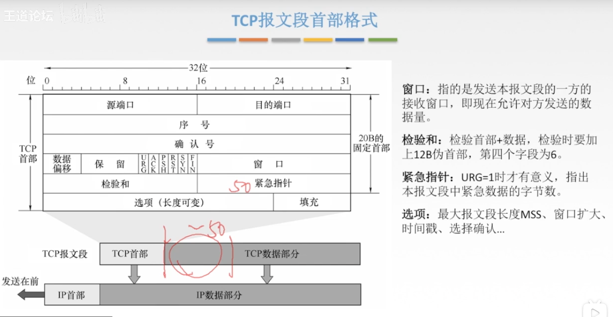

[TOC]

## 传输层概述

### 传输层

传输层是主机才有的层次

传输层为应用层提供通信服务，使用网络层的服务

传输层的功能：
1.传输层提供进程和进程之间的逻辑通信（传输层是端到端通信的开始）

2.复用和分用（复用就是：假如A，B，C同时寄信，那么三者都把信放在信封里，等邮递员去寄信；分用：就是邮递员将信放到邮箱里，收信人各自拿回自己的信）
3.传输层对收到的报文进行差错检测（网络层的IP数据报里的首部检验和只是检验数据报的首部，而数据报的数据部分其实就是传输层的报文段，报文段在传输层检测）

4.传输层的两种协议（传输层不一定提供的是🉑️靠传输，TCP是🉑️靠传输，但是UDP是不🉑️靠传输）

### 传输层的两个协议

### 传输层的寻址与端口

端口号只有本地才有意义，同一主机的不同进程的端口号是不同的

端口号分为 服务端使用的端口号（一般指服务器之类的） 和 客户端使用的端口号（这个是动态分配的，仅在客户进程运行时才动态分配端口号，结束就会回收该端口号）

### 套接字

套接字唯一标识了网络中的一个主机和它上面的一个进程

## UDP协议

### 用户数据报协议UDP概述

UDP只是在IP数据报服务上增加了复用分用和差错检测功能

UDP的主要特点：
1.UDP是🈚️连接的，减少了开销和发送数据之前的时延

2.UDP使用最大努力交付，即不保证🉑️靠交付

3.UDP是面向报文的，适合一次性传输少量数据的网络应用（应用层给UDP多长的报文，UDP就照样发送，即一次发一个完整报文）

4.UDP🈚️拥塞控制，适合很多实时应用（🈚️拥塞控制说明：尽管当前网络很拥塞，发送方还是不管的，这样适合那些实时性的应用，尽管难免会出现丢包的问题）

5.UDP首部开销小，8B，TCP20B

### UDP首部格式

UDP的首部包括首部字段和数据字段（首部字段是8B，数据字段可以是0B或者有数据）

16位源端口号：如果发送方不需要收到对方的回复，那么这里🉑️填对应的端口号或者直接填0000

16位UDP长度：是指整个UDP数据报的长度（包括首部和数据部分）

16位UDP检验和：检测整个UDP数据报是否有错，错就丢弃

### UDP校验

伪首部只有在计算检验和时才出现，不向下传送也不向上递交

伪首部包括源IP地址，目的IP地址，第三部分是0（固定的），17（用来区分使用的协议是UDP还是TCP），UDP长度（UDP首部加上数据部分长度）

## TCP协议特点和TCP报文段格式

### TCP协议的特点

每一条TCP连接只能有两个端点，因此TCP是不适用于广播的

TCP提供全双工通信，因此每一方都🉑️以充当发送方和接收方，因此都要具备发送缓存和接受缓存。发送缓存是缓存准备发送的数据和已发送但尚未收到确认的数据，接收缓存是缓存按序到达但尚未被特定应用程序读取的数据和不按序到达的数据

### TCP面向字节流

TCP把应用程序交下来的数据看成仅仅是一连串的**无结构的字节流**

比如应用层传递下来的报文到了传输层就会被视为一连串的字节流，当要发送出去时，是对一定数量的字节进行TCP的包装然后发送出去

### TCP报文段首部格式

序号：在一个TCP连接中传送的字节流中的每一个字节都按顺序编号，本字段表示本报文段所发送数据的**第一个字节的序号**，比如：发送1，2，3字节的数据，那么TCP首部的序号就是1，发送6，7，8那么TCP首部的序号就是6

确认号：**期望**收到对方下一个报文段的第一数据字节的序号。若确认号位N，则证明到序号N-1为止的所有数据都已正确收到，比如接收方已经收到了1，2，3字节，那么就会回复给发送方一个确认号4，表示前面3个字节已经接收完毕了

### 6个控制位

紧急位URG = 1时，标明此报文段中有紧急数据需要紧急处理，那么该报文段就不用在缓存里排队，直接发送出去

确认位ACK = 1时，在建立连接后所有传送的报文段都必须把ACK置为1

推送位PSH = 1时，标明接收方尽快交付接收应用进程，不再等到缓存填满再向上交付

窗口：接收方收到字节流之后，会给发送方返回一个确认号N以及自己的窗口大小（发送方知道目前接收方的窗口大小了，就会去调整自己的缓存窗口，避免出现丢包或者浪费资源的情况）

检验和：跟UDP的差不多，只不过第四个字段为6（协议字段）

紧急指针：URG = 1时才有意义，指出本报文段中紧急数据的字节数

## TCP连接管理

TCP连接的建立采用**客户服务器方式**，主动发起连接建立的应用进程叫做客户，而被动等待连接建立的应用进程叫服务器。两者只是角色不一样而已，都可以充当发送方和接收方

### 三次握手🤝

假设运行在一台主机（客户）上的一个进程想与另一台主机（服务器）上的一个进程建立一个连接，客户应用进程首先通知客户TCP，他想建立一个与服务器上某个进程之前的连接，客户中的TCP会用以下步骤与服务器中的TCP建立一条TCP连接：（三次握手的过程）

ROUND 1:

客户端发送**连接请求报文段**，无应用层数据（TCP的报文段🈚️数据部分）

> SYN = 1，seq = x(随机)（seq是序号） 控制位SYN = 1标明是连接请求报文段

ROUND 2:
服务器端为该TCP连接**分配缓存和变量**，并向客户端返回**确认报文段**，允许连接，🈚️应用层数据

> SYN = 1 ，ACK = 1, seq = y(随机), ack = x + 1
>
> SYN = 1标明是连接请求接收报文段，确认建立连接后ACK置为1，由于客户发来的seq=x，服务器端已经收到了，因此ack=x+1，期待收到x+1字节开始的部分

ROUND 3:

客户端为该TCP连接**分配缓存和变量**，并向服务器端返回确认的确认，这是🉑️以携带数据（回复确认的确认是客户想告诉服务器端我已经知道建立好连接🉑️以发送数据了）

> SYN = 0, ACK = 1,seq = x+1,ack = y+1
>
> 已经建立好连接了，因此SYN = 0
>
> 建立好连接后，ACK要始终置为1，除非连接释放
>
> 刚才服务器端的ack = x+1，因此此处的seq = x+1
>
> ack = y+1是对刚才服务器端的seq=y的一个确认

### SYN洪泛攻击

攻击者会先给服务器发送一个SYN请求建立连接，当服务器返回ACK后，攻击者不对服务器返回的确认进行确认，那么这个TCP连接就处于挂起状态，服务器收不到再确认的话，就会重复发送ACK给攻击者，这样就会浪费服务器的资源。

🉑️以利用SYN cookie去解决这个问题

### TCP的连接释放

### 四次挥手🙋

参与一条TCP连接的两个进程中的任何一个都能终止该连接，连接结束后，主机中的“资源”（缓存和变量）将被释放

释放过程：（假如是客户端主动终止连接）
ROUND 1:
客户端发送**连接释放报文段**，停止发送数据，主动关闭TCP连接

> FIN = 1, seq = u

ROUND 2:
服务器端回送一个确认报文段，客户到服务器这个方向的连接就释放了——半关闭的状态（此时服务器还是🉑️以发送数据到客户端的）

> ACK = 1，seq = v, ack = u+1
>
> seq = v 取决于之前服务器端发送数据的最后一个字节是多少
>
> ack = u+1 是对刚才客户端seq = u的回复

ROUND 3:

服务器端发完数据，就发出**连接释放报文段**，主动关闭TCP连接

> FIN = 1, ACK = 1, seq = W, ack = u+1
>
> seq = W 取决于刚才发数据的最后一个字节是多少
>
> ack = u+1由于客户端到服务器端方向的连接已经断了，那么ack一直是对ROUND 1的回复

ROUND 4:
客户端回送一个确认报文段，再等到时间等待计时器设置的2MSL（最长报文寿命）后，连接彻底关闭

> ACK = 1， seq = u+1，ack = w+1
>
> 要等待时间等待计时器设置的2MSL的原因是：
>
> 如果返回的确认释放报文段在期间丢失了，服务器端会重新发一个连接释放报文段，那么客户端会再次收到，如果在2MSL里没有收到重新传来的连接释放报文段，就说明确认释放报文段已经成功发送过去了。

## TCP🉑️靠传输

网络层是提供最大努力交付的，不是🉑️靠传输，因此就需要上一层来实现🉑️靠传输

如果传输层使用的是UDP协议，那么🉑️靠传输就要再交付给上一层应用层了

可靠传输：保证接收方进程从缓存区读出的字节流与发送方发出的字节流是完全一样的

TCP实现🉑️靠传输的机制有：1.校验 2.序号 3.确认 和4.重传，其中，校验是跟之前UDP的校验是一样的，通过添加伪首部来实现校验

### 确认机制

发送方将1，2，3字节组成一个报文段发送给接收方，接收方收到之后，将报文段放进接收缓存里，然后返回一个确认报文段 ACK4（表示下一个希望收到的4字节开头的报文段），然后发送方收到ACK 4之后，就会在发送缓存里将刚才发的1，2，3字节组成的报文段删除，然后发送4，5，6字节组成的报文段，但是由于网络原因，7，8字节组成的报文段先到达接收方，那么接收方这时会将7，8字节组成的报文段放进接收缓存里，然后还是发送ACK 4给发送方，这时发送方就知道4，5，6字节组成的报文段可能在传输过程中丢失了，那么就会重新传4，5，6字节组成的报文段，当接收方收到4，5，6字节组成的报文段之后，由于之前已经收到7，8字节了，那么就会返回一个ACK 9的确认报文段

### 重传机制

TCP的发送方在规定的时间内没有收到确认就要重传已发送的报文段（超时重传）

TCP采用自适应算法，动态改变重传时间RTTs（加权平均往返时间）

> 比如第一个报文段从传输开始到收到确认报文段的时间为T1，第二个报文段的时间为T2，那么当第三个报文段传输时就会把RTTs设为(T1+T2)/2，后面以此类推
>
> 这是因为在传输中很多因素会影响到传输的时间，比如当前网络的状况，路由器路由的选择等等

### 冗余确认

## TCP流量控制

流量控制是针对与发送方的（拥塞控制是针对全局的）

TCP利用**滑动窗口**实现流量控制

在通信过程中，接收方根据自己接收缓存的大小，动态地调整发送方的发送窗口大小，即🉑️接收的窗口rwnd（接收方设置确认报文段的窗口字段来将rwnd通知给发送方），发送方的发送窗口取决于接收窗口rwnd和拥塞窗口cwnd的最小值

> 比如接收方发送了一个接收窗口为6的报文段给发送方，那么发送方就会调节自己的发送窗口为6，当接收方发送的接收窗口为0时，那么发送方就会暂停发送，接收方会将缓存里的报文段上交给对应的进程，然后清空缓存，重新发送一个接收窗口为x的报文段过去发送方

### 🌰

### rwnd为0的后续

当接收方发送rwnd=0给发送方时，发送方就会等待接收方发一个有可用的接收窗口的通知，要是接收方发送的报文段丢失，那么两者就会一直等待导致死锁。

那么为了避免这种情况，TCP为每一个连接设有一个持续计时器，只有TCP连接的一方收到对方的零窗口通知，就启动持续计时器，当持续计时器设置的时间到期，发送方就会发送一个零窗口探测报文段，接收方收到探测报文段时就会给出现在的窗口值，若接收窗口仍为0，那么发送方就重新设置持续计时器，直到接收方发过来的窗口不为0！

## TCP拥塞控制

拥塞控制是全局性的，流量控制是针对发送方的

### 拥塞控制四种算法

接收窗口：接收方根据接受缓存设置的值，并告知给发送方，反映接收方容量

拥塞窗口：发送方根据自己估算的网络拥塞程度而设置的窗口值，反映网络当前容量

#### 慢开始——拥塞避免

一个传输轮次：发送了一批报文段并收到它们的确认的时间（或理解为：一个往返时延RTT，或理解为：开始发送一批拥塞窗口内的报文段到开始发送下一批拥塞窗口内的报文段的时间）

慢开始：是指一开始的拥塞窗口从1开始，以指数形式增加，一开始还比较小，所以称为慢窗口

ssthresh（门限值）：一开始有一个初始化的值，当到了门限制就会开始以加1形式增大拥塞窗口的值（这时就处于拥塞避免）

当检测到网络拥塞了，就会将拥塞窗口重新调节为1，又开始慢开始，而且重设门限值为原来网络拥塞时的窗口值的一半

#### 快重传和快恢复

快重传：当收到3个重复的确认后就执行快重传算法，然后就拥塞窗口设置为门限制（门限制是出现网络拥塞时的拥塞窗口值的一半）

快恢复：从门限制重新开始

#### 重点🌟

当出现超时重传时，无论是慢开始-拥塞控制还是快重传-快恢复，都要将拥塞窗口设为1

## 传输层总结🌟

