[TOC]

## 网络应用模型

### 应用层概述

应用层对应用程序的通信提供服务

应用层协议定义：
1.应用进程交换的报文类型，请求还是响应？

2.各种报文类型的语法，如报文中的各个字段及其详细描述。

3.字段的语义，即包含在字段中的信息的含义。

4.进程何时、如何发送报文，以及对报文进行响应的规则。

因此根据应用层协议的定义可以总结以下应用层的功能：

1.文件传输、访问和管理

2.电子邮件

3.虚拟终端

4.查询服务和远程作业登录

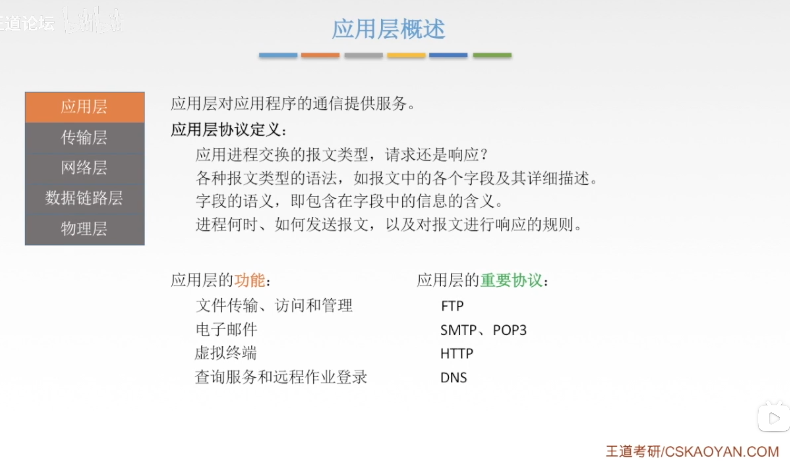

### 网络应用模型

客户/服务器模型和P2P模型（对等模型）

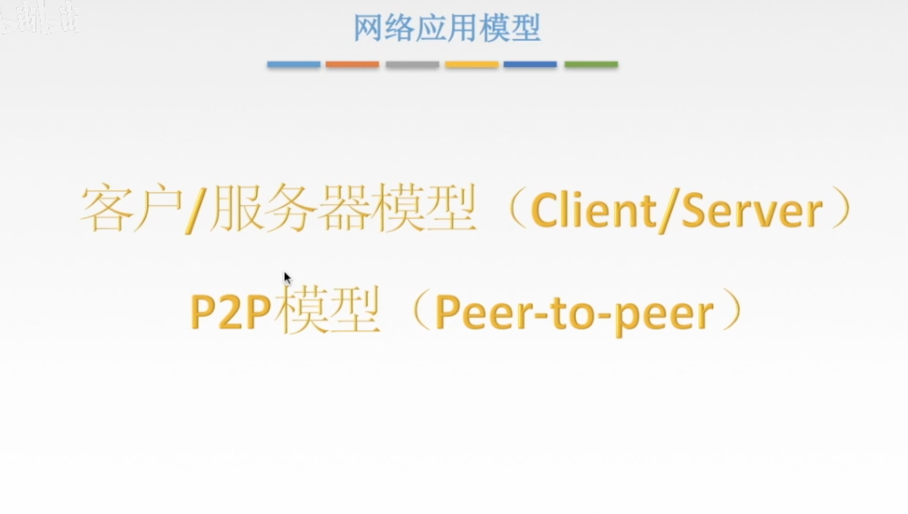

### 客户/服务器（C/S）模型

服务器：提供计算服务的设备

> 1.永久提供服务（没有间歇性的）
>
> 2.永久性访问地址/域名

客户机：请求计算服务的主机

> 1.与服务器通信，使用服务器提供的服务
>
> 2.间歇性接入网络
>
> 3.可能使用动态IP地址
>
> 4.不与其他客户急直接通信（比如主机A要跟主机B聊天，主机A发送的信息会先到达聊天室的服务器，聊天室的服务器再去转发给主机B，这个过程其实是客户机跟服务器之间的通信）

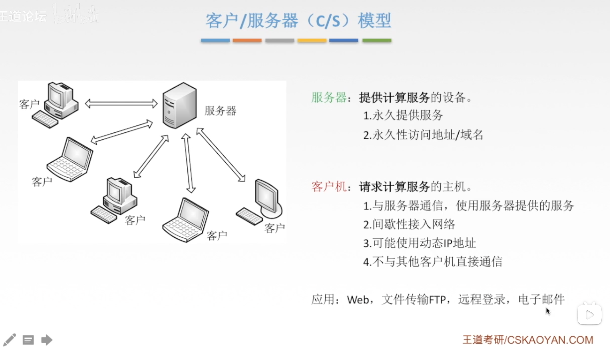

### P2P模型（对等模型）

每个主机既可以提供服务，也可以请求服务（既可以充当客户机，也可以充当服务器）

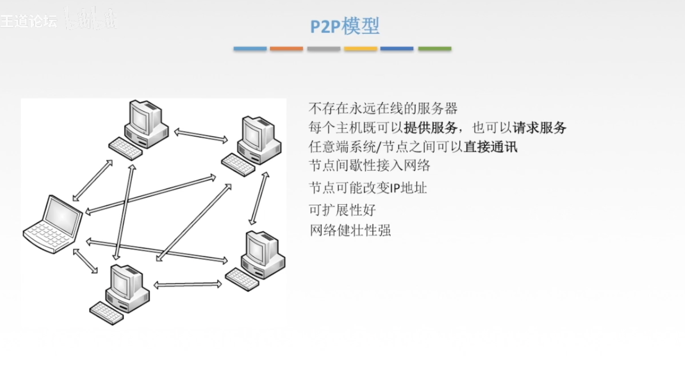

## DNS系统

当我们访问某一台主机时，是要利用到IP地址才能访问到，但是我们总不能把这么长的IP地址都记下来，这时就有一种简便的方法来替代IP地址，就是域名，比如百度的域名http://www.baidu.com/，我们只需要通过搜索域名就可以访问到百度的网页，而搜索域名就可以访问到对应的IP地址，这项工作的解析是靠DNS域名解析来实现的，DNS会将域名解析为IP地址然后去访问IP地址

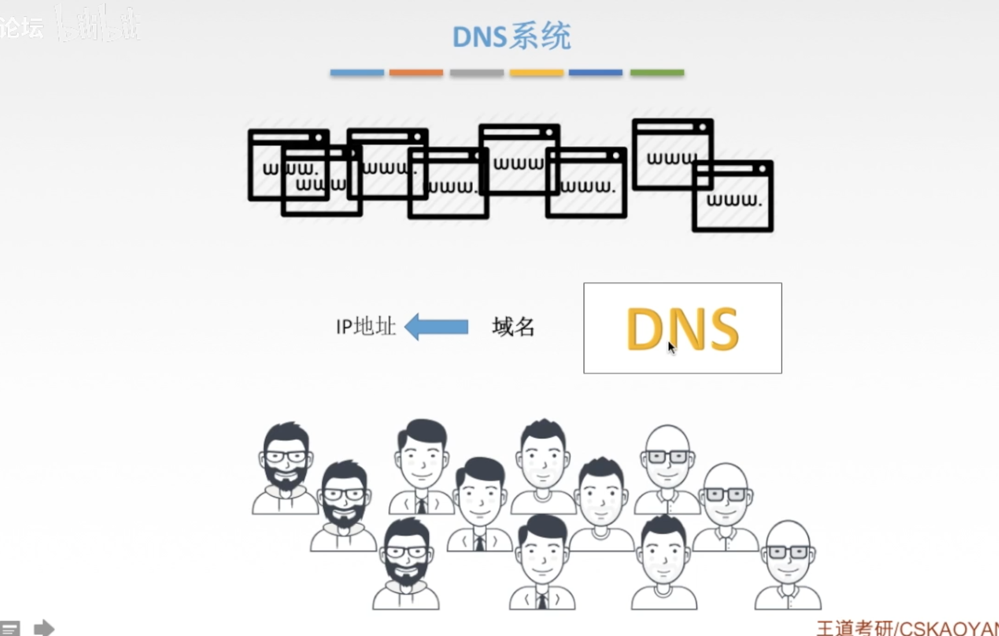

### 工作流程

我们在主机上输入一个域名，然后进行搜索，首先域名会先到达DNS服务器，DNS服务器将域名进行解析，解析到的IP地址返回给主机（用户不需要知道，但是主机间的通信是需要目的IP地址），然后主机通过IP地址去访问目的主机

因此，如果访问网页出现故障，原因大概为以下三点

1.输入的域名不正确

2.DNS服务器出现故障，解析域名失败

3.要访问的网页的服务器出现故障，不能返回数据

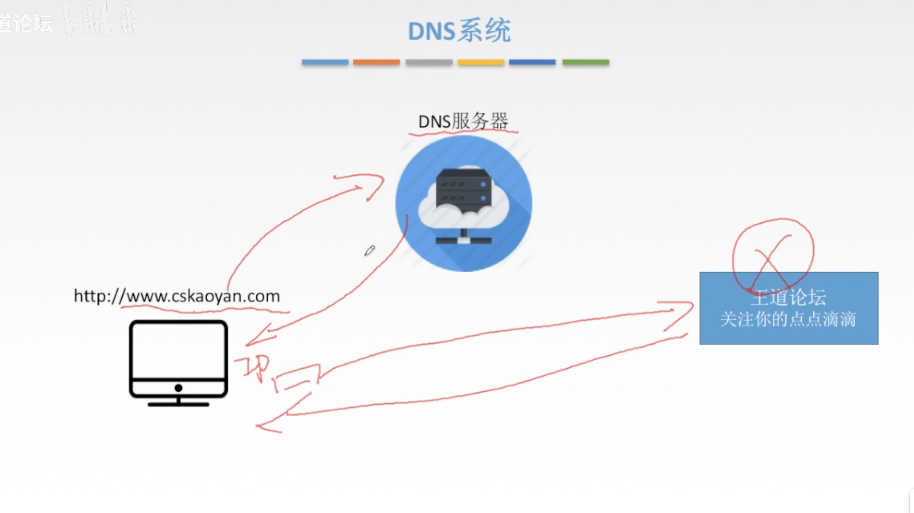

### 域名

www.cskaoyan.com. ——在最后面有一个.是表示根

根据.号从左向右域名等级逐步提高，分为顶级域名，二级域名，三级域名等

顶级域名 可以是

> 1.国家顶级域名 cn，us，uk
>
> 2.通用顶级域名 com（公司企业），net（网络服务机构），org（非盈利组织），gov（机构政府），int（国际组织），aero（航空领域），museum（博物馆），travel（旅游）
>
> 3.基础结构域名/反向域名 arpa（用于将IP地址反向解析为域名）

二级域名

> 类别域名 ac,com,edu(教育),gov,mil(邮件服务),net, org（这里有一些域名是跟顶级域名相似的，因为会出现顶级域名为国家级域名的情况比如.com.cn表示中国的公司网页）
>
> 行政区域名 用于我国各省，自治区，直辖市 比如bj，js

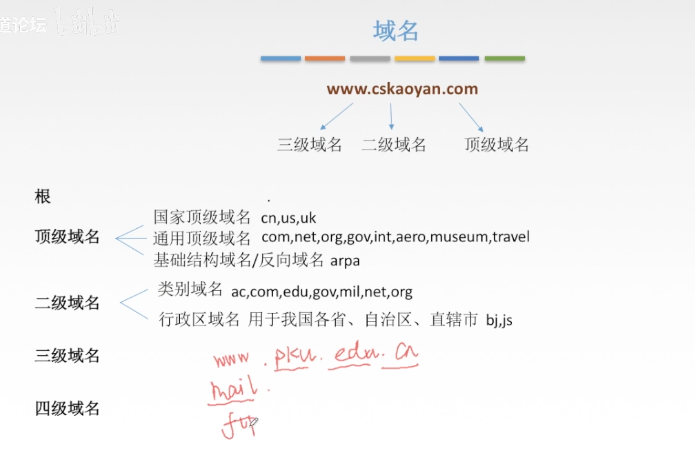

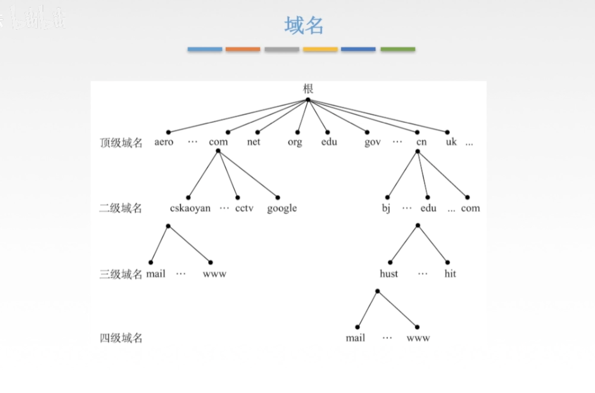

### 域名服务器

DNS服务器有很多台，根据层次可划分为三种：根域名服务器，顶级域名服务器，权限域名服务器

而本地域名服务器不属于层次划分结构中，当主机与另一台比较近的主机通信时，就不用走更高级的域名服务器，以及当两次或以上请求某个网页时，本地域名服务器也会保存有第一次请求的网页的域名和IP地址的映射表，就可以直接通过本地域名服务器直接解析

当主机请求解析的域名不在本地域名服务器的缓存之内，那么本地域名服务器就会去请求最高级的服务器-根域名服务器，根域名服务器会根据域顶级域名查询，然后交付给顶级域名服务器，以此往下查询

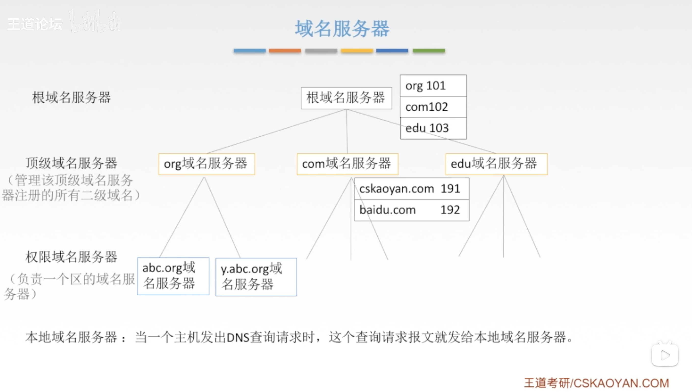

### 域名解析过程

域名解析有两种方式：递归查询 和 迭代查询

递归查询是指：当本地域名服务器查不到要解析的域名，就会去请求根域名服务器的帮助，根域名服务器解析不出，就会去找对应的顶级域名服务器的帮助，顶级域名服务器还解析不出来，就会去找权限域名服务器的帮助，最后将查询到的结果依次从权限域名服务器开始返回，最后返回到主机

迭代查询是指：当本地域名服务器查不到要解析的域名，就会去问根域名服务器，根域名服务器就会告诉本地域名服务器去询问哪一个顶级域名服务器，顶级域名服务器也会告诉本地域名服务器去询问哪一个权限域名服务器，然后根据每一轮的询问结果组装成一个IP地址，发送给主机

为了减少本地域名服务器的负担，本地域名服务器里是有一个高速缓存的，解析过的域名与IP地址的映射会存放在高速缓存里，当再次查询时就可以直接获得，而且，映射表中的每一项也是有存活时间的，高速缓存是动态更新的。

不仅本地域名服务器有高速缓存，主机也有，每次开机，主机就会下载本地域名服务器里的映射表保存在自己本机的高速缓存中，因此解析域名时，会先查询本主机是否有对应的域名解析，没有才会去询问本地域名服务器。

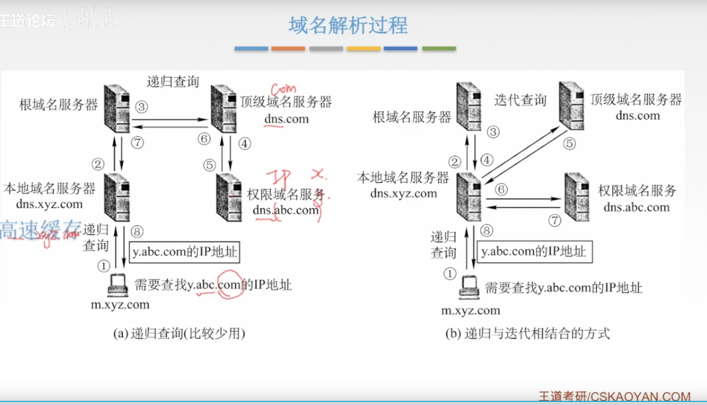

## 文件传输协议FTP

### 文件传送协议

文件传送协议 包括 文件传送协议FTP 和 简单文件传送协议TFTP

> 文件传送协议FTP：指的是提供不同种类主机系统（硬、软件体系等都可以不同）之间的文件传输能力——可以适配不同的操作系统
>
> 简单文件传送协议TFTP；适用于小机器以及传送小文件的情况，比较容易实现

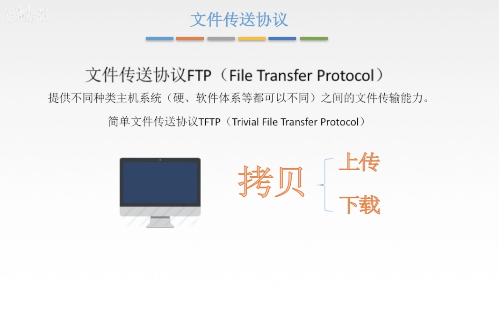

### FTP服务器和用户端

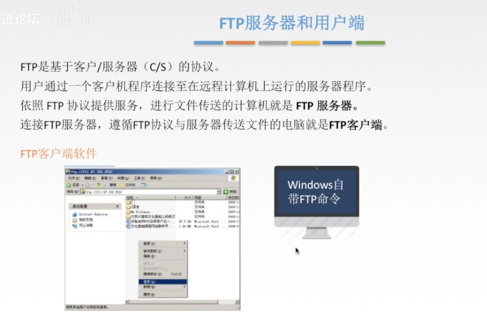

### FTP工作原理

首先用户需要在FTP服务器上登录（用户密码登录或者匿名登录），登录之后才有权限去操作文件

而FTP使用TCP实现可靠传输

FTP服务器里有一个主进程和n个从属进程

> 一个主进程：主进程里主要管理的是服务器与其他主机的端口连接，当主机发出与FTP服务器连接请求时，主进程就会分配从属进程去管理主机与服务器之间的连接，并且提供文件传输的功能
>
> n个从属进程：

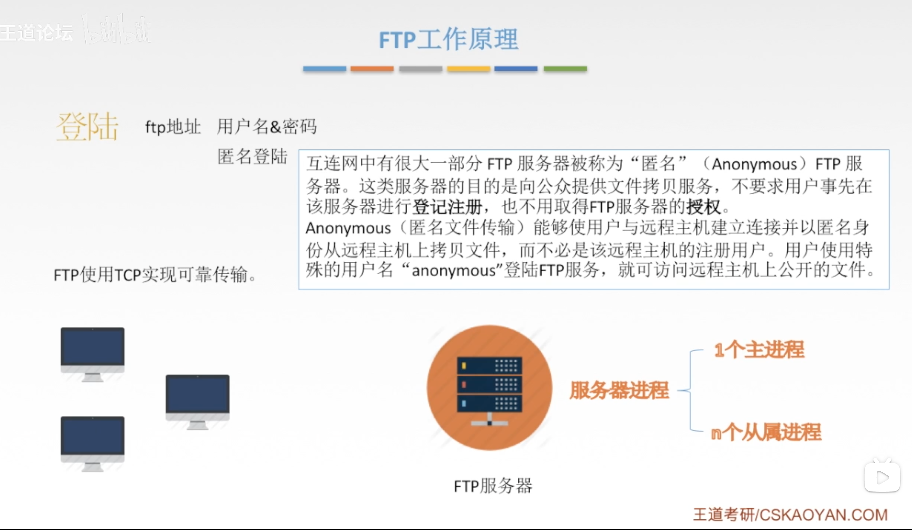

客户端和服务器端各有控制进程和数据传送进程

控制进程连接是始终打开的，数据传送进程是传送的时候才保持打开的

当客户端想要跟FTP服务器端取得连接时，就会通过TCP控制连接端口传送请求，当服务器端同意连接后就可以在数据传送进程传送数据

是否使用TCP 20端口建立数据连接与传输模式有关

主动方式使用TCP 20端口

被动方式由服务器和客户端自行协商决定（端口 > 1024）

> 主动方式是：客户端向服务器请求连接时，并告知服务器端自己数据传送进程的端口号，然后服务器端会根据传来的端口号跟客户端进行连接
>
> 被动方式是：客户急向服务器请求连接时，会顺带询问服务器端数据传送进程的端口号，那么两者经过协商之后决定的端口号作为数据连接端口

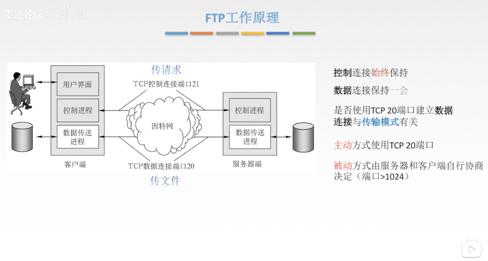

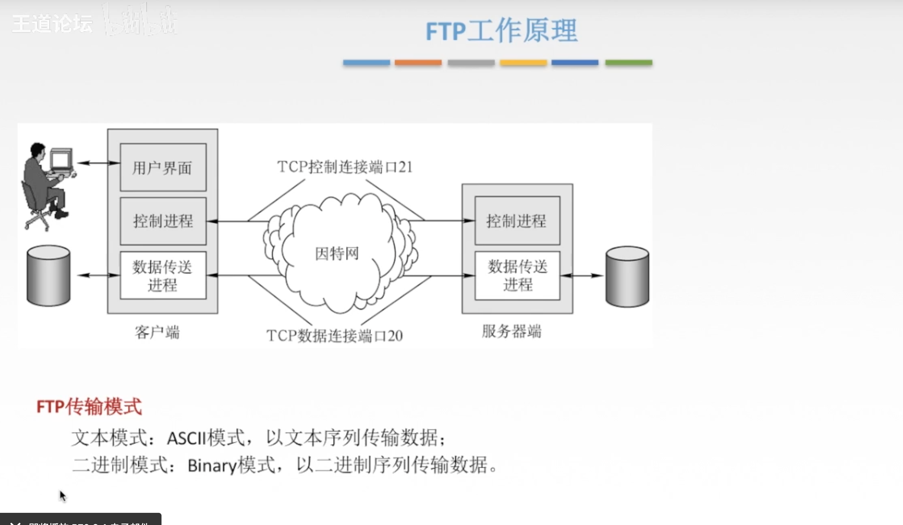

## 电子邮件

### 电子邮件的信息格式

Subject 可以理解为标题或者大纲

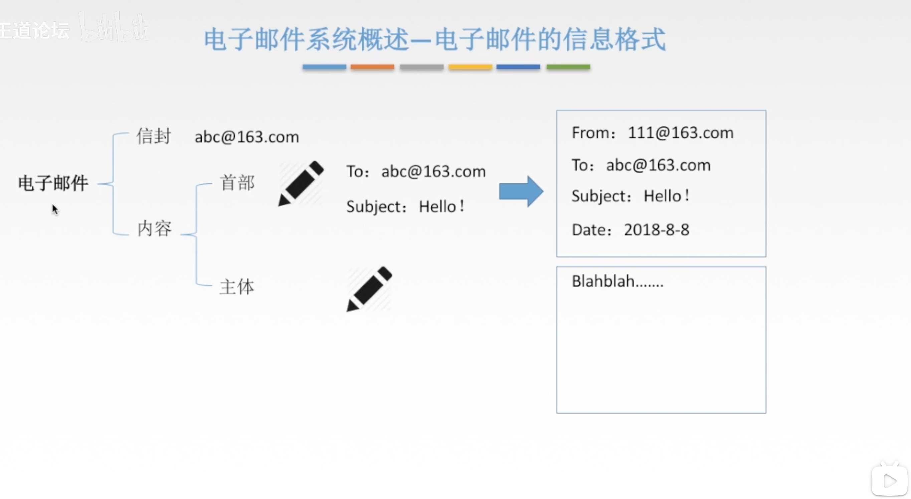

### 电子邮件系统概述-组成结构

由三部分组成：用户代理，邮件服务器，以及协议

用户代理：也可以理解为电子邮件客户端软件，功能是1.撰写2.显示3.处理4.通信

邮件服务器：功能1.发送&接收邮件2.向发件人报告邮件传送结构（C/S）

协议：发邮件的协议（SMTP），接收/读取邮件的协议（POP3/IMAP）

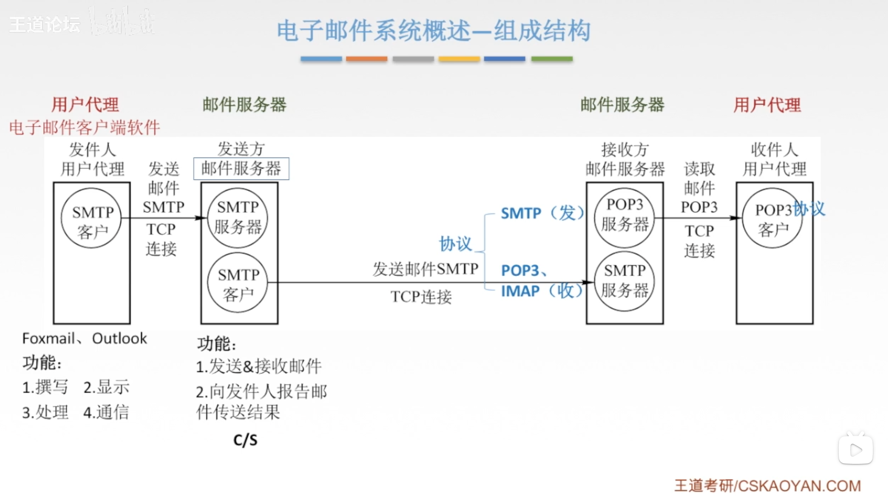

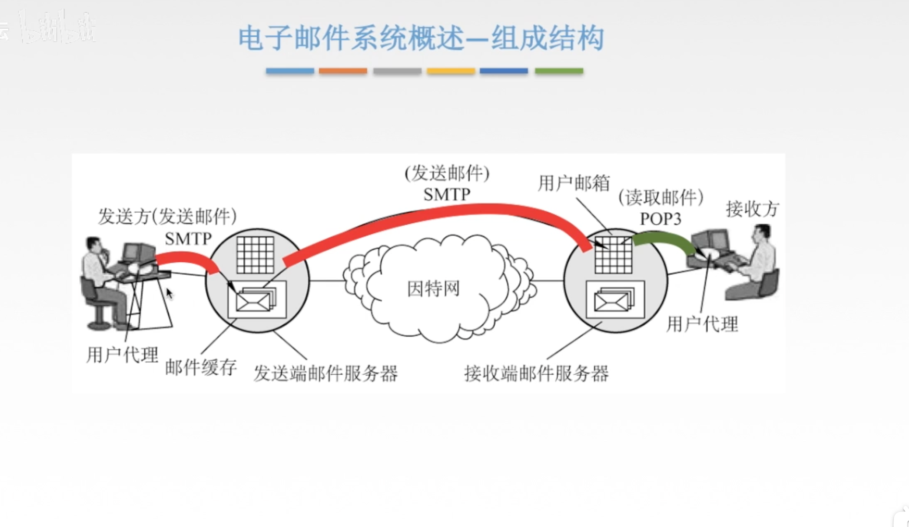

### 简单邮件传送协议SMTP

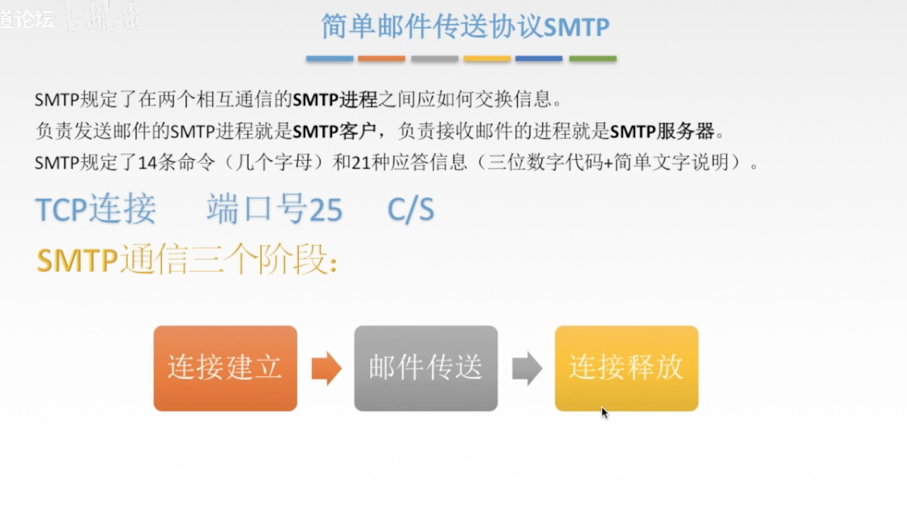

#### 三个阶段

SMTP协议是基于SMTP客户端 和 SMTP服务器端的

连接建立：发件人的邮件发送到发送方邮件服务器的邮件缓存后，SMTP客户（这里是发送方邮件服务器）就每隔一定时间对邮件缓存扫描一次。如发现有邮件，就使用SMTP的熟知端口号25与接收方邮件服务器的SMTP服务器建立连接。在连接建立后，接收方SMTP服务器就会发送“220 Service ready”（服务就绪），然后SMTP客户向SMTP服务器发送HELLO命令，并附上发送方的主机名。如果SMTP服务器有能力接收邮件，那么就会回答”250 OK“

邮件发送：SMTP客户先发送一个MAIL命令，如果SMTP服务器准备好接收邮件，就回答“250 OK”，否则返回一个错误代码，SMTP服务器准备就绪后，SMTP客户就会发送一个RCPT命令，SMTP服务器就会查询是否有这个用户（收件人），SMTP服务器就会返回对应信息，如果存在该收件人SMTP客户就会发送DATA命令，表示准备开始传输邮件的内容，然后SMTP服务器就会返回是否同意接收邮件。同意后，SMTP客户开始传送邮件信息，发送内容完毕后，再发送<CRLF>.<CRLF>来表示结束，若邮件接收了，SMTP服务器就会返回对应信息

连接释放：邮件发完，SMTP客户发送QUIT命令，SMTP服务器返回“221”，表示同意释放TCP连接

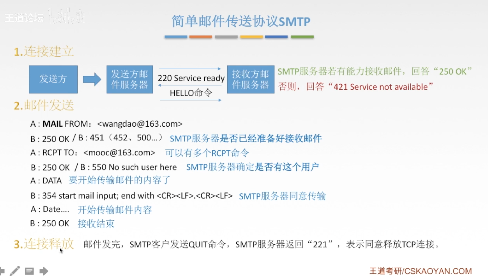

### MIME

SMTP的缺点：

1.SMTP不能传送可执行文件或者其他二进制对象

2.SMTP仅限于传送7位ASCII码，不能传送其他非英语国家的文字（比如中文是传送不了的）

3.SMTP服务器会拒绝超过一定长度的邮件

那么MIME是对SMTP的改进，使得电子邮件系统可以支持声音、图像、视频、多种国家语言等等

用户传送的非ASCII码会先经过MIME转换为7位ASCII码，然后再进行传送

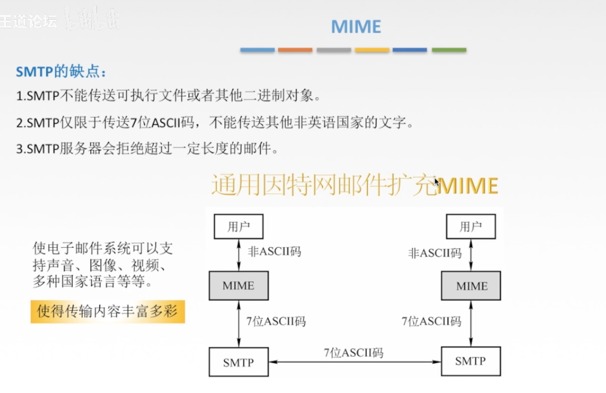

### 邮局协议POP3

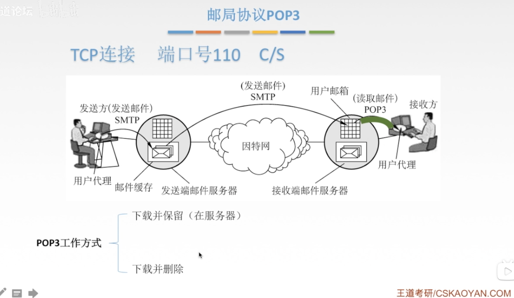

### 网际报文存取协议IMAP

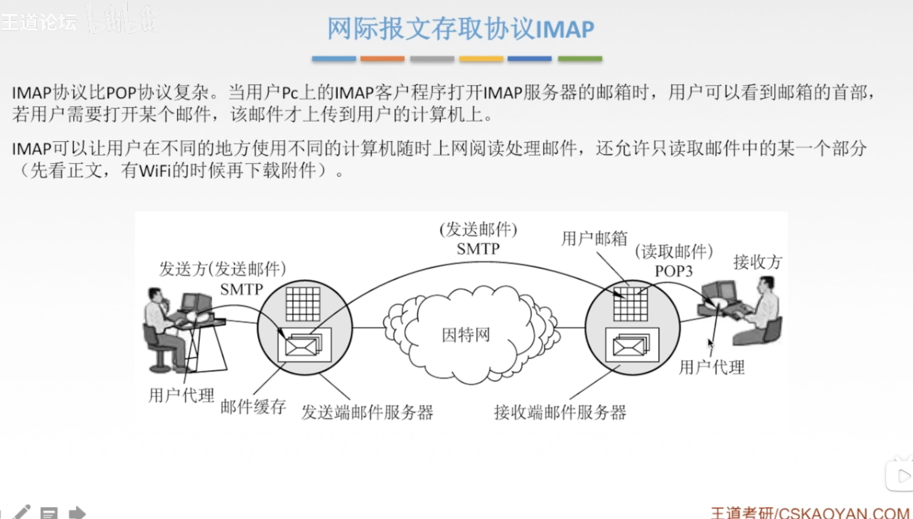

### 基于万维网的电子邮件

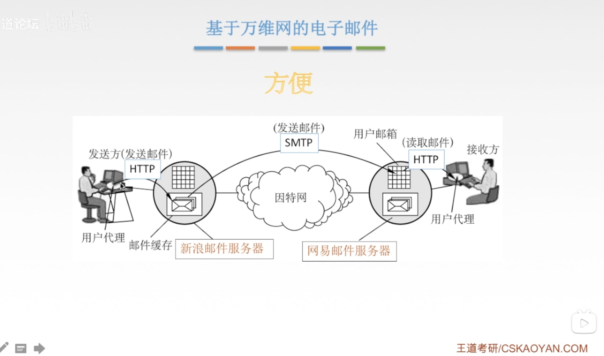

### 总结🌟

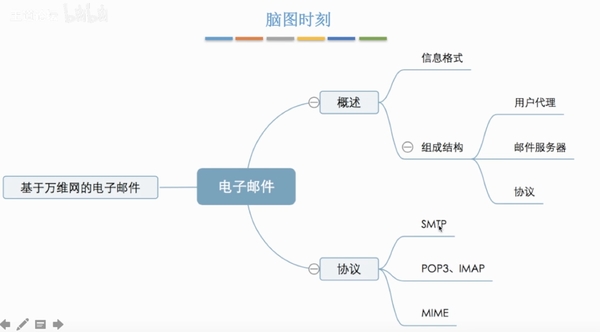

## 万维网和HTTP协议

 ### 万维网概述

万维网是一个大规模的、联机式的信息储藏所/资料空间，是无数个网络站点和网页的集合

万维网通过统一资源定位符URL去唯一标识资源（文件、视频、音频等）

URL不分大小写

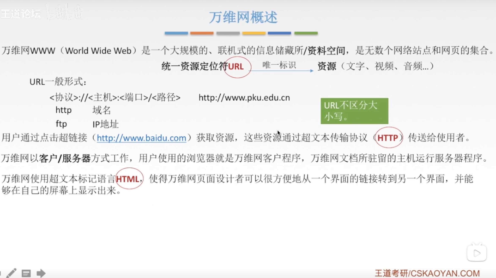

### 超文本传输协议HTTP

HTTP协议定义了浏览器（万维网客户进程）怎样向万维网服务器请求万维网文档，以及服务器怎样把文档传送给浏览器。

用户浏览页面的方法：1.输入URL 2.点击超链接🔗

具体过程：

> 1.用户输入URL或者点击超链接之后
>
> 2.浏览器分析URL
>
> 3.DNS解析出IP地址
>
> 4.浏览器与服务器建立TCP链接
>
> 5.浏览器发出取文件命令
>
> 6.服务器响应
>
> 7.释放TCP
>
> 8.浏览器显示（浏览器显示之后大概率只是下载了文本部分，如果有音频或者视频都是点了之后再去请求下载的）

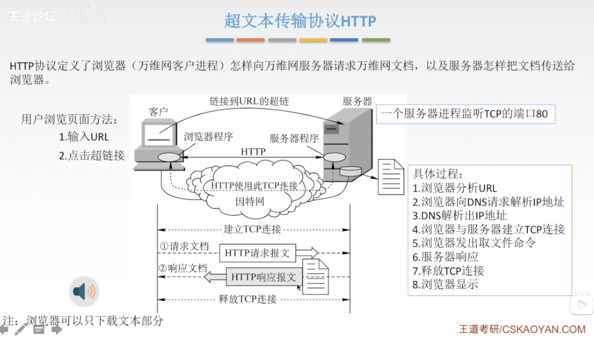

### HTTP协议的特点

HTTP协议是无状态的——就是说同一个客户在前后两次访问的网页返回的数据是一样的

但是在实际中，一些万维网站点常常希望能够识别用户，比如淘宝之类的，那么就要利用到Cookie

Cookie是存储在用户主机中的文本文件，记录一段时间内某用户的访问记录，以便提供个性化服务

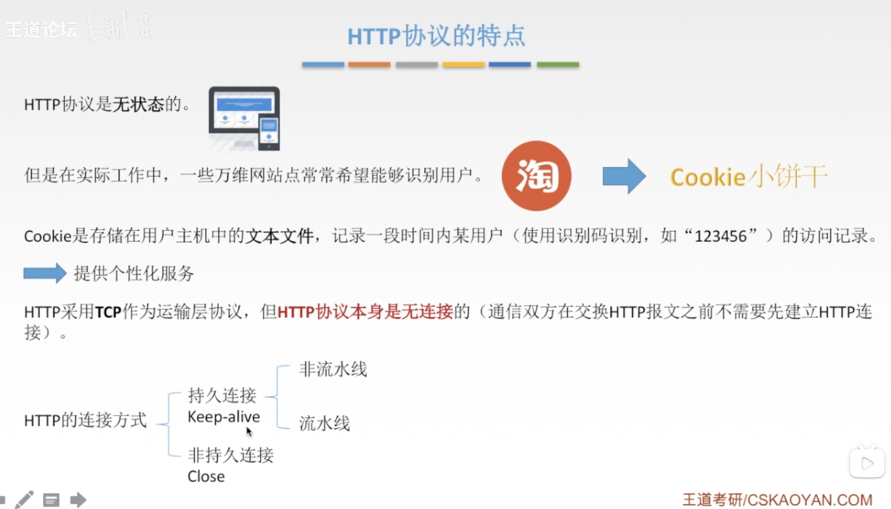

### HTTP协议的连接方式

HTTP的连接方式分类持久连接和非持久连接

非持久连接：客户连进行TCP连接，在第三次握手时传送HTTP请求报文，那么服务器就会返回HTTP响应报文，但是如果还要再请求一次，就要重新建立连接

持久连接：TCP连接之后一段时间会一直保持连接

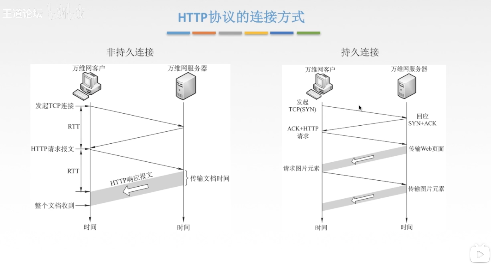

持久连接又分为流水线和非流水线

流水线：客户可以一次性发出多个HTTP请求报文，而这样只需要一个RTT时间就可以显示要请求的数据。

非流水线：要等上一个HTTP请求报文收到响应之后才能发送下一个HTTP请求报文。

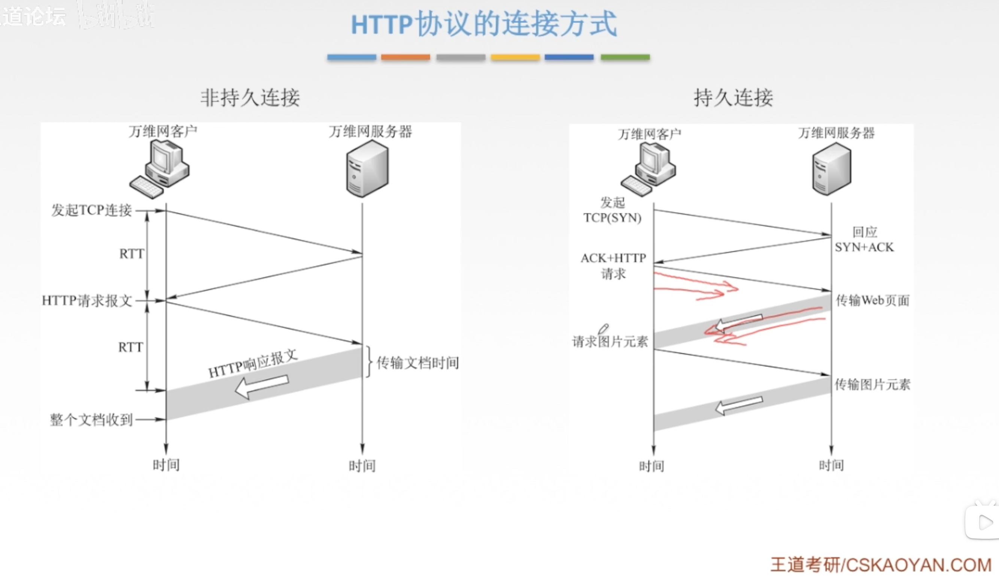

### 超文本传输协议HTTP—报文结构

HTTP报文分为 请求报文 和 响应报文

CRLF回车换行符，标志结束

开始行：用于区分是请求报文还是响应报文

方法：就是对所请求的对象进行的操作

版本：就是指明使用了哪个版本的HTTP

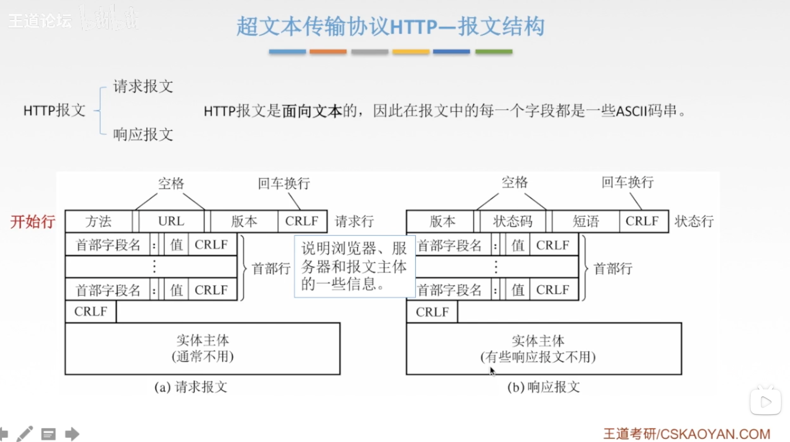

### 超文本传输协议HTTP-报文结构

请求报文中：方法GET表示获取URL下的信息，index.html使用了相对URL（即忽略了主机的域名）是因为下面的首部行给出了主机的域名，Close表示使用的是非持久连接，告诉服务器传输完数据之后要释放连接，Cookie是用户访问这个网页的标识符，有Cookie表示用户之前就已经访问过了

响应报文中：状态码和短语的结合就表示对于请求报文信息的响应

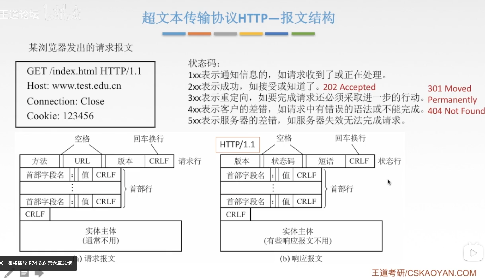

## 总结🌟

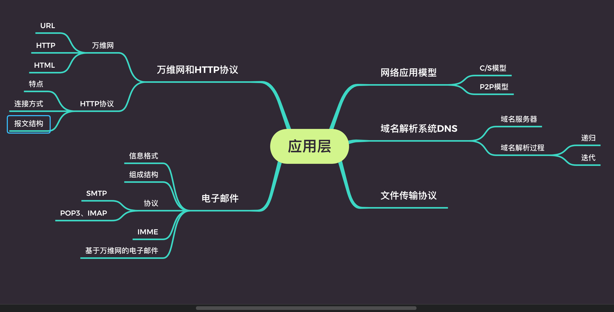
