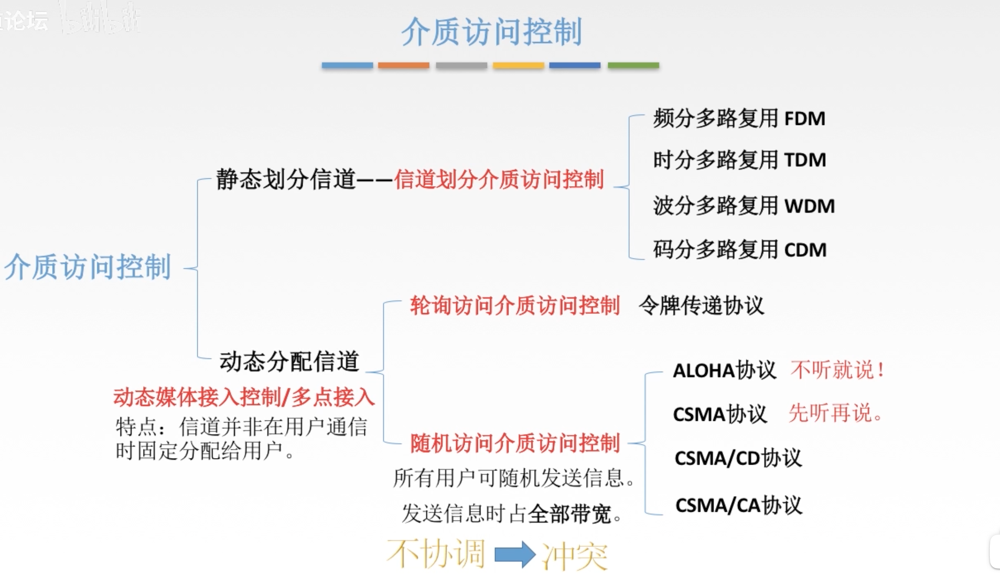
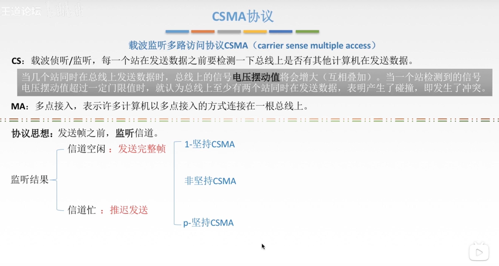
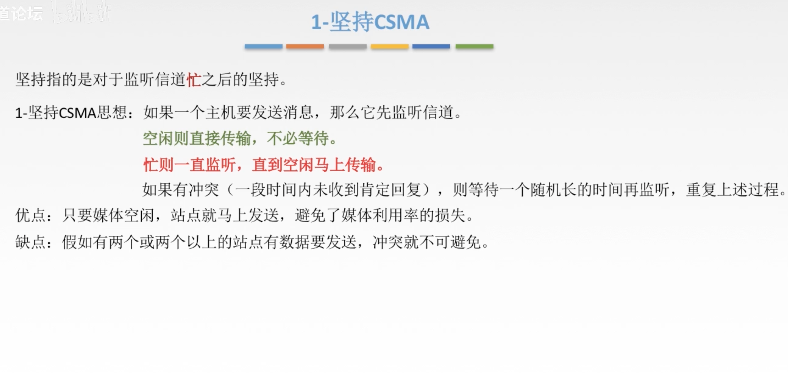
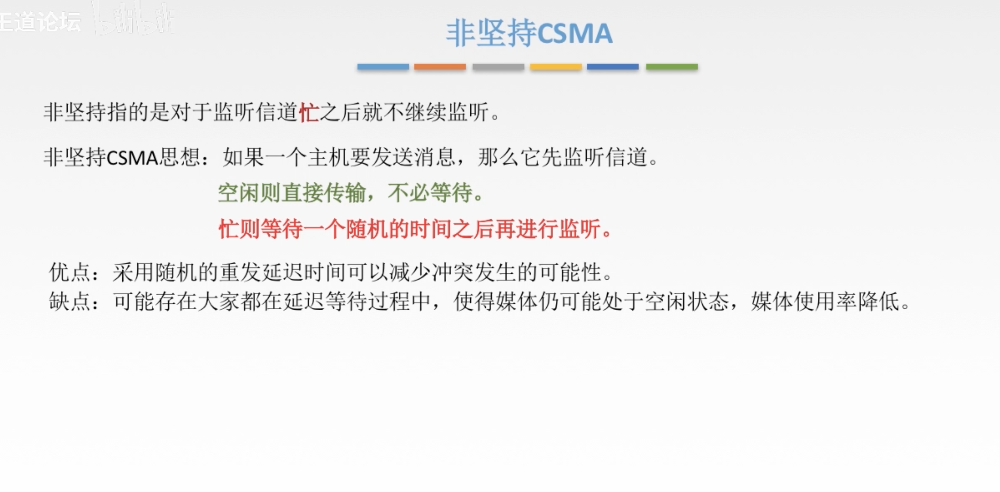
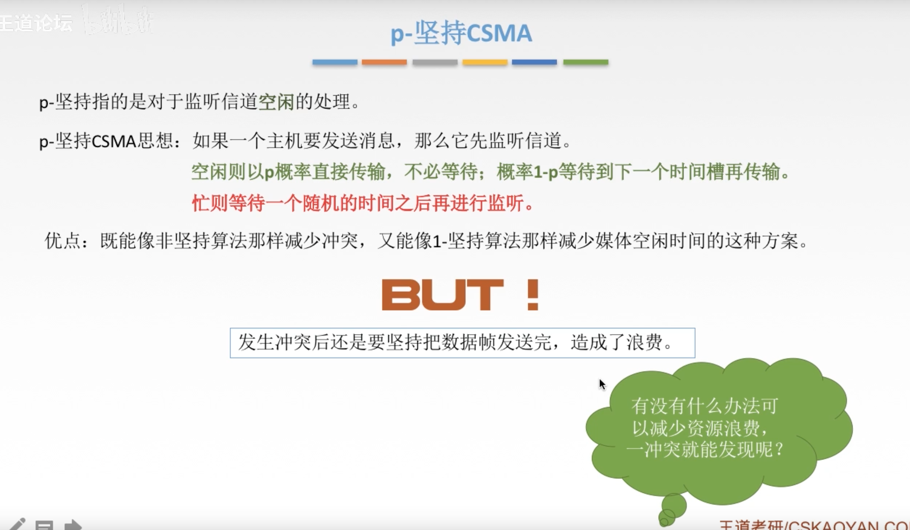
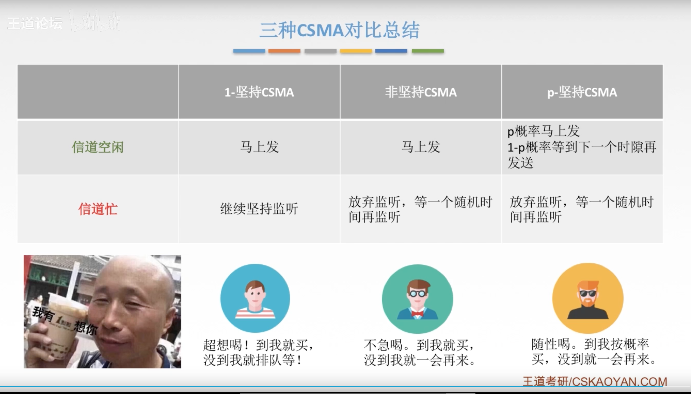

[TOC]

# 第三章

## 数据链路层

#### 检错编码——CRC循环冗余码

- 计算冗余码的步骤

  > 1.加0——看多项式是多少阶（比如多项式100111是6位的，那么阶就是5），那么就要在传的数据后面加上5个0
  >
  > 2.模2除法——数据加0之后除以多项式，余数为冗余码（或者叫FCS帧检验序列）

- 发送端对发送的数据进行差错控制之后，接收端收到这一组比特之后，按模2出发，要是余数为0就判定无错，否则判定发生错误

- 当接收端接收这一组比特流之后就默认判定这组数据是没有差错的，也可以理解为无比特差错传输，但这并不是可靠传输
- 可靠传输指的是：数据链路层发送端发送了什么，接收端就接收到什么——是真正意义上的没有比特错误的传输

#### 差错控制（纠错编码）

- 利用海明码进行纠错编码
- 局限性：发现双比特错，纠正单比特错

##### 确定校验码位数r

##### 确定校验码和数据的位置

##### 求出检验码的值

- P1的最后一位是1，那么就去找每一个数据位看谁的最后一位是1的，然后将他们进行亦或结果要为0，从而求出P1的值，P2，P3，P4同样如此

##### 检错并纠错

- 接收端收到数据时，会进行一个检错和纠错，首先也是进行异或，然后异或的结果从后往前写出结果（从P4写到P1——结果为0101）那么就是第五位发生了错误，然后直接可以进行纠错

#### 流量控制与可靠传输机制

- 较高的发送速度和较低的接受能力的不匹配，会造成传输出错，这时候就很需要用到流量控制
- 数据链路层的流量控制是点对点的（点对点是指相邻结点之间的传输），而传输层的流量控制是端到端的（端到端是发送端和接收端之间的传输）

#### 流量控制的方法（数据链路层）——停止-等待协议 以及 滑动窗口协议

- 停止-等待协议 效率较低，因为发送方要收到接收放的确认之后才能发送下一个数据

- 数据链路层的滑动窗口在发送过程中大小是固定的，而传输层的滑动窗口是不固定的

#### 停止等待协议

- 在早期传输设备还不够发达的时候，数据链路层要实现好可靠传输，所以就要用到停止等待协议以及滑动窗口协议，但是现在设备越来越发达，数据链路层只需做好差错控制，而可靠传输就交给了传输层去实现，而我们没必要去纠结停止等待协议和滑动窗口协议是属于哪一层，不管在哪一层，两者的实质都是一样的，只是传输的实体不一样，数据链路层的是帧，传输层的是分组

##### 停止等待协议——无差错情况

- ACK 0 表示接收方收到了发送方发送过来的0帧，然后回复确认收到

##### 停止等待协议——有差错情况

###### 数据帧丢失或检测到帧出错

- 当发送方发送0帧之后，就会自动开启一个计时器，如果在计时器结束之前收到一个确认帧那就停止计时器，发送1帧，开启新的计时器，但是如果计时器结束还没收到确认帧，那么发送方就会重新传送0帧
- 当接收方接收到0帧之后，如果检测到帧出错，那么会把这个帧丢弃掉，不回复确认帧，等发送方重新发一个0帧过来

###### ACK丢失

###### ACK迟到

- 发送方发送0帧之后，经过一个计时器时间没有收到确认帧，就会重新发送0帧，而接收方接收到两个0帧，会丢弃重复的0帧，然后回复确认帧，当发送方收到两个ACK 0 时，就会默认是之前的确认帧迟到了，会自动把它丢弃

##### 停止-等待协议性能分析

- 信道利用率太低了

##### 信道利用率

##### 停止-等待协议总结

#### 后退N帧协议(GBN)

- 停止等待协议的信道利用率太低了，发送窗口最多只能发送一个帧，而且还要收到确认帧之后才能发送下一个帧
- 为了提高传输的效率，我们可以增大发送窗口发送的帧数，那么就必须增加序号范围以及发送方需要缓存多个分组（缓存分组是为了解决帧丢失情况下发送方重新发送帧的情况）

- 后退N帧协议与停止等待协议的区别在于——停止等待协议的发送窗口和接收窗口都只能是1个，而后退N帧协议的发送窗口可以是多个，接收窗口是1个
- 在后退N帧协议中，滑动窗口包括有1，2，3，4，5，6号帧，当里面都已经有数据时，可以将窗口里的帧发送出去，同时拷贝一个副本，当收到来自接收方的确认帧之后，发送方就将对应的帧标记已被确认，然后滑动窗口往后移

##### GBN发送方必须响应的三件事

- 累计确认：当发送方发出了0，1，2号帧，那么接收方接收了这3个帧之后，发送了一个ACK 2表示2号帧以及之前的都已经接收了，累计确认机制——接收方就不需要对每一个帧都发送一个确认帧
- 超时事件——当发送方发送了0，1，2，3，4，5，6，7号帧时，接收方收到了0号帧，发送确认帧ACK 0，那么它知道下一个要接收到的应该是1号帧，但是由于1号帧在发送过程中丢失了，接收方只能收到2，3，4，5，6，7号帧，由于收到的不是它期待的1号帧，那么接收方是不会发送确认帧的，等到发送方的定时器超时，由于发送方只收到了ACK 0，那么发送方就要重新发送1，2，3，4，5，6，7号帧

##### GBN在接收方要做的事

- 接收方如果收到了N号帧， 并且之前收到的帧都是连续的，那么就会发送一个ACK N
- 其余情况下，比如收到了0和1号帧，那么接收方期待收到的是2号帧，结果下一收到的帧是3号帧，那么接收方会把3号帧后面的丢弃，发送一个ACK1，表示只接收到连续的0，1号帧，要求发送方重新发送2号帧以及后面的帧

##### 运行中的GBN

- 定时器超时：发送方要重传所有已发送但未被确认的帧

##### 滑动窗口的长度

##### GBN协议重点总结

- 偶尔捎带确认——接收方有时候也要发送一些数据到发送端，那么会顺带将确认帧也发送过去
- 发送窗口的最大尺寸被定下来之后运行时就不会再改变

##### GBN性能分析

##### 后退N帧协议GBN总结

#### 选择重传协议SR

- GBN协议的累计确认机制会导致批量重传的问题，为了解决这些问题，就需要用到选择重传协议SR，这能大大提高效率

##### 选择重传协议中的滑动窗口机制

- 接收方中的5号帧还没收到，但是已经收到了6号帧，那么就会把6号帧先缓存起来，等到5号帧也传过来时，再将5，6号帧交付给网络层，然后滑动窗口往后移两格

##### SR发送方必须响应的三件事

##### SR接收方要做的事

- 如果收到了窗口序号外（小于窗口下界）的帧，就返回ACK（因为接收方已经接收前面的数据了，而发送方重新发送过来是因为之前该帧的ACK丢失了或者迟到了）

##### 运行中的SR

##### 滑动窗口长度

- 发送窗口最好等于接收窗口 = 2^(n - 1) （n的取值：当帧的编号为0，1，2，3，那么就是由2个比特组合成的4种编码，那么n就等于2）
- 窗口长度过长，很容易出现接收方无法确认收到的帧是新帧还是旧帧

##### SR协议重点总结

##### 选择重传协议SR总结

#### 信道划分介质访问控制（静态划分信道）

##### 传输数据使用的两种链路

- 点对点链路一般用在广域网即范围比较大的网络下
- 广播式链路一般用在局域网即范围比较小的网络下——在广播式链路下，比如A，B，C，D都连在一条总线上，当A发送信息时，信息会沿着总线进行传输，然后B，C，D收到该信息之后看该信息的目的地址是不是自己，如果是自己就接收信息并处理，如果不是则不管

##### 介质访问控制（主要是针对广播式链路）

- 在广播式链路中，只有一个主机在发送信息。但是如果同时有两个或者以上的主机发送信息就很容易引发冲突，为了避免这种情况，我们就要对它们共享的介质进行一个访问的控制

- 介质访问控制的内容就是——采取一定的措施，使得两对节点之间的通信不会发生互相干扰的情况

- 多路复用技术：在复用器将多个信号组合之后一起在信道上传输，到达分用器时再将信号分开，分别传送到不同的目的主机上

##### 静态划分信道

###### 频分多路复用FDM

- 连在这条链路上的不同主机占用不同的频率，发送信息时互不干扰
- 任何时间都可以占用着信道去发送信息

###### 时分多路复用TDM

- 连在同一条链路上的主机只能在特定的时间内占用信道去发送信息
- TDM帧是物理层传送的比特流所划分的帧，表示一个周期，跟数据链路层的帧不一样

###### 统计时分复用STDM

- 这是对时分多路复用TDM的进一步改进，TDM的信道利用率太低了
- STDM——将连接在一条链路上的主机要发送的信息先送进一个集中器的输入缓存中，然后集中器按输入的顺序将数据放入STDM帧中，当构成一个完成的STDM帧时就会将数据发送出去

###### 波分多路复用WDM

- 波分多路复用就是光的频分多路复用，其实就是特殊的频分多路复用，WDM是应用在光纤中的

###### 码分多路复用CDM

- 每一台主机相当于一个站点，它会被指定一个唯一的m位的芯片序列，当站点发送比特1时就发送芯片序列，当发送0时就发送芯片序列反码
- 每个站点的芯片序列相互正交（站点A的芯片序列与站点B的芯片序列按位相乘然后相加结果为0），那么就可以做到发送数据互不影响
- 合并数据：将站点A发送的比特的芯片序列与站点B发送的比特的芯片序列按照线性相加
- 分离数据：合并后的数据和站点的芯片序列规格化内积（按位相乘然后相加，结果/位数）得出的结果就是站点要发送的比特信息

#### 动态分配信道

- 动态分配信道也可以叫为动态媒体接入控制/多点接入，特点——分配给主机的信道并不是固定的

##### ALOHA协议

- ALOHA协议有两种 纯ALOHA协议以及时隙ALOHA协议

###### 纯ALOHA协议

- 纯ALOHA协议——想发就发
- 如果站点A发送了数据，尽管在发送过程中有别的站点比如站点B也发送了数据，这时候就会产生冲突，但这时的冲突发送方和接收方都是不知道的，等到接收方收到了数据，检测出错，不返回该数据的确认帧，那么发送方就会判断刚发送的数据发生了冲突。而发生了冲突之后，发送方会在之后的随机时间重新发送数据

###### 时隙ALOHA协议

- ALOHA协议 发送数据的成功率太低了，而时隙ALOHA协议是对ALOHA协议的进一步改进
- 时隙ALOHA协议控制了之前ALOHA协议想发就发的随意性
- 时隙ALOHA协议将时间分成了若干个相同的时间片，用户在时间片刚开始时才可以发送信息

###### ALOHA协议总结

- 吞吐量——可以理解为数据发送成功的概率

##### CSMA协议

- ALOHA协议是不监听信道的，CSMA协议在发送信息之间是先监听信道

###### 1-坚持CSMA

- 一直监听信道直到信道空闲
- 当站点A在信道上发送了信息之后，站点B，C，D都在监听着信道什么时候是空闲的，当信道空闲时，B，C，D都会同时发送信息，这样又会有新的冲突

###### 非坚持CSMA

- 监听到信道忙时是等待一个随机的时间之后再去重新进行监听

###### p-坚持CSMA

- 主机监听到信道空闲时，是一定的概率去决定是否立刻发送信息

###### 三种CSMA总结

- 以太网 - 简单来说就是有线网 早期是由交换机组成的局域网

- CSMA/CD协议

  >"多点接入"——总线型网络
  >
  >“载波监听“——每个站不管是在发送前，还是在发送中都会去检测信道
  >
  >”碰撞检测“——”边发送边监听“

  

- 集线器——传统以太网是使用电缆，后面改用为双绞线，而集线器就是利用双绞线跟每个站点连接起来

- 以太网的MAC层

  > 在局域网中，硬件地址又称为物理地址或者MAC地址

- 在物理层扩展以太网 - 集线器

  > 由于是在物理层扩展的，是不对数据进行处理的
  >
  > 好处：扩大了范围
  >
  > 坏处：增大了碰撞发生的概率

- 在数据链路层扩展以太网 - 网桥

  > 网桥能够对数据进行处理 ——对收到的帧根据其MAC帧的目的地址进行转发和过滤。当网桥收到一个帧时，并不是向所有的借口转发此帧，而是根据帧的MAC地址，查找网桥中的地址表，然后再进行数据的转发
  >
  > 好处：1.扩大了物理范围（扩大的范围比集线器更加大——由于网桥可以作为一个站转发信息，而且本身具有检测碰撞的功能，不像集线器只是转发信息）
  >
  > ​		   2.过滤通信量
  >
  > ​           3.提高了可靠性
  >
  > ​           4.可连接不同层的局域网 （对数据进行了转换——这是集线器做不到的（集线器在物理层不对数据进行处理））
  >
  > 坏处：存储转发存在延时

- 网卡

  > 网卡又称为网络接口卡或者网络适配器，主要是将计算机和服务器等设备连接到数据网络中
  >
  > 

- 服务器

  > 其实就是代码编写的一个可以根据用户请求实时的调用执行对应的逻辑代码的一个容器

- 以太网交换机

  > 实质上就是一个多接口的网桥 ， 工作方式：全双工

  > 在内部，以太网交换机通过自学算法自动建立帧交换表（又称为地址表）

  > 工作原理：一开始交换机内部的交换表是空的，然后当A端口发送信息到网桥，这时候网桥会记录下信息的源地址（MAC地址），时间，以及端口，交换机会去寻找交换表里是否有跟目标地址对应的端口，如果没有，那么交换表会向所有的端口发送这个信息，如果有这个端口，那么就会过滤掉其他端口，只向这个端口发送信息，那么现在交换表里就会存储这个端口的信息，下次发送就可以直接发送了

- 广播风暴

  > A端口要想B端口发送信息，内部CD端口一直在循环无效的信息寻找，那么就会一直浪费网络资源，这就是“广播风暴”

> 解决办法：利用生成树协议STP 去切掉不必要的环路 减少资源的浪费

- 虚拟局域网

  > 之前交换机之间的联系需要有线牵连，而虚拟局域网在这基础上进行了改善
  >
  > 现在信息的传递是靠VLAN网段去识别目标地并发送信息过去

- 高速以太网

  - 100BASE-T以太网

    > 100BASE-T是在双绞线上传送100Mbit/s基带信号的星形拓扑以太网

  - 吉比特以太网

# 第四章

## 网络层

> 主要任务是把`分组`从源端传到目的端，为分组交换网上的不同主机提供通信服务。网络层传输单位是`数据报`
>
> > 分组与数据报简单来说就是父与子的关系
> >
> > 数据报是一串很长的数字信息，而将数据报进行分割，就会变成一份份的分组

- 网络层的功能

  1. 路由选择与分组转发

     > 寻找转发分组的最佳路径

  2. 异构网络互联

     > 比如 路由器将 手机 电脑 校园网 之类 的连接起来

  3. 拥塞控制

     > 若所有结点都来不及接受分组，而要丢弃大量分组的话，网络就处于拥塞状态。因此要采取一定措施来缓解这种拥塞
     >
     > 措施1.开环控制 （静态方法）—— 在传输之前规避有可能导致网络拥塞的情况
     >
     > 措施2。闭环控制（动态方法）——传输开始之后自动调整来避免网络拥塞

- 流量控制 （对比拥塞控制）

  > 流量控制 是 发送方发送信息过来 接收方告诉发送方 发慢点 

- 网络层的核心是路由器，路由器可以把不同的网络连接起来（4G，wifi），根据IP地址进行转发

- IP地址与硬件地址（MAC地址或者物理地址）

  - 物理地址是在数据链路层和物理层使用的地址，而IP地址是网络层和以上各层使用的地址，是一种逻辑地址（因为IP地址是用软件实现的）
  - 使用IP地址的IP数据报一旦交给了数据链路层，就被封装成MAC帧了，而MAC帧在传送时使用的源地址和目的地址都是硬件地址，这两个硬件地址都写在了MAC帧的首部中
  - 而连接在通信链路上的设备收到MAC帧时，根据MAC帧首部中的硬件地址决定收下或丢弃
  - 而剥去MAC帧的首部和尾部后把MAC层的数据上交给网络层后，网络层才能在IP数据报的首部中找到源IP地址和目的IP地址

- 地址解析协议ARP - 实现IP地址和MAC地址的相互转换

- 当主机要发送信息出去，先根据网卡的指引 将信息转发到路由器，然后路由器内部将MAC地址转换成IP地址，查看目的地址是否在自己的局域网范围内，如果在就直接转发，如果不在，就根据路由器里的交换表，将IP数据报发送到对应的路由器上

- MAC帧的目的地址是转发到的下一个路由器的地址或者主机

### 划分子网

- IP地址从两级划分为三级

  - 划分的原因 

    1.IP地址的空间利用率低

    2.两级IP地址不够灵活

- 划分子网是一个单位内部的事情，本单位以为的网络看不见是由多少个字网组成的，因为这个单位对外表现为一个网络

- 划分子网的方法是从网络的主机号借用若干位作为子网号

- 从其他网络发送给本单位某位主机的IP数据报，仍然是根据IP数据报的目的网络号找到连接在本单位网络上的路由器，路由器接收到IP数据报之后，再按目的网络号和子网号找到目的子网，把IP数据报交付目的主机

#### 子网掩码

- 从IP数据报的首部是无法看出源主机或目的主机所连接的网络是否进行了子网的划分，这时候就要使用到子网掩码，子网掩码是存储在路由器上的，根据路由器上的子网掩码，可以找到目的地址所在的子网
- 把子网掩码跟IP地址进行逐位的 与 ，找到所要找的网络地址

#### 使用子网时分组的转发

- 使用子网划分后，路由器上的路由表必须包含三个内容：目的网络地址，子网掩码和下一跳地址

####  路由器转发分组的算法

- 从接受的数据报的首部提取目的IP地址D
- 先判断是否直接交付（即是否在当前路由器的子网中），用该路由器下的网络的子网掩码（每台主机上都会一个子网掩码）和D按位与，看结果是否和网络地址匹配，若匹配，则将IP地址转换成物理地址，把数据报封装成帧发送出去）
- 若路由器表中有目的地址为D的特定主机路由，则直接把数据报传送给路由表中所指的下一跳路由器，否则执行下一步
- 进行间接交付，将路由表中的每一行数据的子网掩码跟D进行按位与，看是否有匹配的，如果有匹配的那就将数据报传送到下一跳的路由器
- 若路由表中有一个默认路由，则把数据报传送到默认路由指定的路由器
- 上面的操作都没有把数据报传送出去，那么就会报告分组转发失败

#### CIDR（无分类编码）——构造超网

- CIDR消除了传统的A类，B类和C类地址以及划分子网的概念
- CIDR将32位地址分为 `网络前缀` ➕ `主机号`，网络前缀的长度是可变的
- CIDR还使用“斜记法”也叫“CIDR记法”，即在IP地址后面加上斜线“/”，然后写上网络前缀所占的位数
- CIDR中 原来的子网掩码 改为 地址掩码， 二者作用差不多
- 使用CIDR地址块之后，路由表要存的数量大大减少
- 最长前缀匹配——在查找路由表时可能会得到不止一个匹配结果，这样会从匹配结果中选择具有最长网络前缀的路由进行转发
- 使用CIDR之后，由于要寻找最长前缀匹配，使理由表的查找过程变得更加复杂，因此为了进行更加有效的查找，通常是把无分类编址的路由表存放在一种层次的数据结构中，然后自上而下地按层次进行查找——这里最常用的就是二叉嗖搜索——树

### 网际控制报文协议ICMP

- ICMP允许主机或路由器报告差错情况和提供有关异常情况的报告

- ICMP报文作为IP层数据报的数据，加上数据报的首部，组成IP数据报发送出去

- ICMP报文有两种：ICMP差错报告报文和ICMp询问报文

- ICMP差错报告报文有四种

  > 1.终点不可达——当路由器或主机不能交付数据时就向源点发送终点不可达报文
  >
  > 2.时间超过——IP数据报有个TTL字段（用来写明该数据报在传输过程中存在的时间，当TTL变为0时，就会被丢弃），当路由器收到生存时间为零的数据报时，除丢弃数据外，还向源点发送时间超过报文
  >
  > 3.参数问题——当路由器或主机收到的数据报的首部中的字段的值不正确时，就丢弃数据，并向源点发送参数问题报文
  >
  > 4.改变路由（重定向）路由器把改变路由报文发送给主机，让主机知道下次应将数据报文发送给另外的路由器

- 下面是不发送ICMP差错报告报文的情况

  > 1.对ICMP差错报告报文，不再发送ICMP差错报告报文
  >
  > 2.对第一个分片的数据报片的所有后续数据报片，都不发送ICMP差错报告报文
  >
  > 3.对具有多播地址的数据报，都不发送ICMP差错报告报文
  >
  > 4.对具有特殊地址的数据报，不发送ICMP差错报告报文

- ICMP询问报文

  > 1.回送请求和回答——用来测试目的站是否可达以及了解有关状态
  >
  > 2.时间戳请求和回答——ICMP时间戳请求报文是请某台主机或路由器回答当前的日期和时间

### 互联网的路由选择协议——讨论路由表中的路由是怎么得出的

- 路由选择协议的核心就是路由算法

- 路由算法具备以下特点

  > 1.算法必须是正确和完整的
  >
  > 2.算法在计算上是简单的
  >
  > 3.算法应能适应通信量和网络拓扑的变化
  >
  > 4.算法具有稳定性
  >
  > 5.算法应是公平的
  >
  > 6.算法应是最佳的——最佳只是相对于某一种特定要求下得出的较为合理的选择

#### 非自适应路由选择和自适应路由选择

- 非自适应路由选择——简单和开销小，不能及时适应网络状态的变化——可以应用在简单的小网络上
- 自适应路由选择——能较好地适应网络状态的变化，但实现较为复杂，开销也很大

