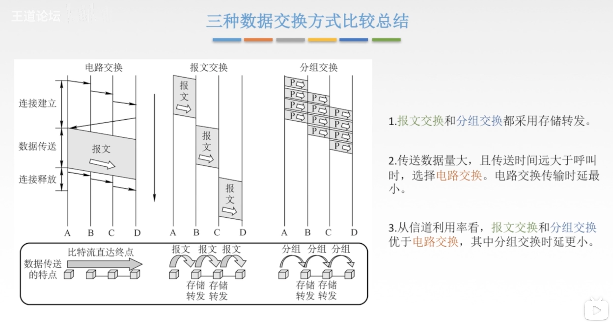
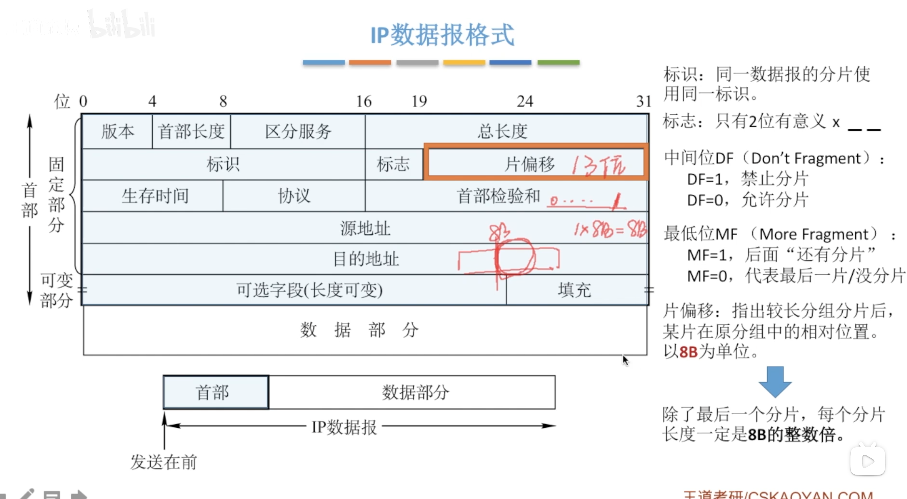

[TOC]

## 网络层

### 网络层概述

网络层传输单位是数据报，当数据报很大的时候，就会对它进行分组，所以，数据报和分组其实就是父与子的关系

#### 网络层功能

拥塞控制：若所有结点都来不及接受分组，而要丢弃大量分组的话，网络就处于拥塞状态。因此要采取一定措施来缓解这种拥塞。常见的措施有开环控制和闭环控制。

而拥塞控制和流量控制是不一样的。拥塞控制是全局性的，而流量控制只是在于发送方的。

### 数据交换方式

#### 网络的“掌中宝”

网络层的核心设备是路由器，通过路由器可以将不同的主机连接在一起进行通信

#### 为什么要数据交换

如果没有交换设备，那么主机之间的通信就要通过链路来连接，那么就要需要很多很多的链路

而有了交换设备之后，主机都可以连接在交换设备上，那么链路的需求量就大大减少了，但是连接的主机变多，交换设备就要有更多的端口，而且如果要跟很远地方的主机相连，就需要一条很长的链路，链路一长，数据在传递过程中就会有损耗

那么这时候就用到了交换网络，通过交换网络将不同的路由器连接起来，那么🉑️以实现大范围的通信

#### 数据交换方式

数据交换方式包括 电路交换，报文交换，和分组交换

##### 电路交换

电路交换的流程是：先建立连接，然后实现通信，通信完之后就释放连接。

一旦线路建立了连接，那么在整个通信过程中都是直接占用那一条链路，直到通信结束，释放连接。

优点是

> 1.通信时延小
>
> 2.有序传输
>
> 3.没有冲突——因为直接占用链路的资源了，不会发生冲突的
>
> 4.实时性强

缺点是

> 1.建立连接时间长——发送方要先拨号，等到接收方那边收到信息并同意建立连接
>
> 2.线路独占，使用效率差——占用了线路之后，如果不发送任何信息也是占用线路的，这样就会浪费资源
>
> 3.灵活性差——如果连接的线路上有交换设备宕机了，那么连接就会中断，传送不了任何信息
>
> 4.无差错控制能力——线路上的交换设备只负责转发信息，不会对信息进行差错检测以及纠错

##### 报文交换

报文：指源应用发送的信息整体

优点

> 1.不像电路交换要先建立连接
>
> 2.存储转发，动态分配线路——当发送方将报文发送到交换设备，交换设备会先存储起来，然后等到线路空闲的时候才转发出去
>
> 3.线路🉑️靠性较高，当线路中有交换设备出现故障，还🉑️以选择别的交换设备进行转发
>
> 4.线路利用率高
>
> 5.多目标服务——同一个报文🉑️转发到多个目标上

缺点

> 1.有存储转发时延——交换设备在存储报文时会有存储转发时延
>
> 2.报文大小不定，需要网络节点有较大缓存空间

##### 分组交换

分组交换：是大的数据块分割成小的数据块（分成的数据块🉑️以有大有小，也🉑️以均等）

分组交换也是采用了存储转发的方式

优点

> 1.无需建立连接
>
> 2.存储转发，动态分配线路——但是对交换设备的缓存空间要求没有像报文交换那么大
>
> 3.线路🉑️靠性较高
>
> 4.线路利用率较高
>
> 5.相对于报文交换，存储管理更容易

缺点

> 1.有存储转发时延
>
> 2.需要传输额外的信息量（比如对分组进行编号，每个分组还要编上源地址和目的地址）
>
> 3.乱序到目的主机时，要对分组排序重组

##### 报文交换&分组交换

传输同样的数据，分组交换所需要的时间更少，因此在现实生活中，主要采用的是分组交换

##### 三种数据交换方式比较总结

#### 分组交换包括数据报方式与虚电路方式

数据报方式为网络层提供无连接服务

> 无连接服务：不事先为分组的传输确定传输路径，每个分组独立确定传输路径，不同分组传输路径可能不同

虚电路方式为网络层提供连接服务

> 连接服务：首先为分组的传输确定传输路径，然后沿该路径（连接）传输系列分组，系列分组传输路径相同，传输结束后拆除连接

#### 不同层的传输单位

应用层的传输单位是报文——比如在微信要发送一个文件，那么这个文件就是一个报文

传输层的传输单位是报文段——报文段是对报文的进一步封装，如果报文过大，那么在传输层就会将报文切割成一组报文段

网络层的传输单位是IP数据报，分组——IP数据包是对报文段的进一步封装，如果IP数据包过大，也会分成一组分组

数据链路层的传输单位是帧，帧是对IP数据报/分组的进一步封装

物理层的传输单位是比特流，将数据链路层传递下来的帧转化为比特流，然后进行传输

### 数据报与虚电路

#### 数据报方式

数据报是利用了无连接的服务

每个分组都携带源地址和目的地址

路由器收到分组时，会先缓存起来，然后去检索路由表，然后在对应接口转发分组

目标主机收到的分组可能是有序的，也可能是乱序的。

#### 虚电路方式

虚电路将数据报方式和电路交换方式结合，以发挥两者优点。

通信过程：源主机向目的主机发送“呼叫请求”分组，当目的主机收到源主机发来的“呼叫请求”分组时，沿着原路径给源主机发送“呼叫应答”分组。当源主机收到“呼叫应答”分组之后才算建立连接。

建立连接之后，源主机发送的每个分组是带有虚电路号的，路由器收到分组之后，会查看分组里的虚电路号，然后沿着对应路径传送分组

当通信结束之后，源主机会向目的主机发送“释放请求”分组以拆除虚电路

#### 数数据报&虚电路的总结🌟

### IP数据报格式

#### 协议栈

#### IP数据报格式

给传输层传递下来的数据添加一个首部，首部里包括固定部分（20字节）和🉑️变部分（但🉑️变部分一般是没有的）

首部的固定部分：
1.版本：指的是使用的IP协议的版本：IPv4还是IPv6

2.首部长度：单位是4B，最小为5位（由于IP数据报的固定部分的长度固定为20B，所以首部长度最小是5 5 * 4B = 20B）

3.区分服务：指示期望获得哪种类型的服务（用得比较少）

4.总长度：包括首部长度和数据部分长度，单位是1B，最大为2^16-1

5.生存时间（TTL）：IP分组的保质期。经过一个路由器TTL就会-1，当变为0时，该IP分组就会被丢弃

6.协议：指的是数据部分的协议

7.首部检验和：只检验首部（IP分组在传输过程中，TTL等数据会发生变化，那么首部检验和是用来检验首部是否出现字段错误，错误则丢弃该IP分组）

8.源地址和目的地址：32位（发送方和接收方的IP地址）

首部的🉑️变部分：

1.🉑️选字段：0到40B，用来支持排错，测量以及安全等措施

2.填充：全0，填0是为了把首部补成4B的整数倍

### IP数据报分片

#### 最大传送单元MTU

链路层数据帧🉑️封装的数据是有上限的MTU

以太网的MTU是1500字节

当要传送的数据报长度超过某链路的MTU值时，就会对数据报进行分片，但是分片的前提是该数据报本身是同意分片的，否则就会返回一个ICMP的错误编码

#### IP数据报里的分片格式

标识：同一数据报的分片使用同一标识

标志：有三位，但只有后两位是有意义的，高位是🈚️用的，中间位DF（Do not Fragment），DF=1表示禁止分片，DF=0表示允许分片，最低位MF（More Fragment）MF=1表示后面“还有分片”，MF=0表示最后一片或者没分片

片偏移：指出较长分组分片后，某片在原分组中的相对位置。以8B位单位。（13位），比如00000000001，就表示1*8B=8B，该分片在原分组中的相对位置为8B

#### IP数据报分片例题

#### 口诀

1总8片首4

### IPV4地址

#### IP地址

要给别的主机发送信息。那么就要知道它在哪个网络以及是哪一台主机（对应的就是网络号和主机号，两者合起来就是IP地址）

#### IP编址的历史阶段

#### 分类的IP地址

主机或路由器的一个接口代表一个IP地址，不一定一个主机或者一个路由器就只有一个IP地址

由于每个区域的主机数量都不一致，因此分成了A，B，C类地址来供不同的需求

#### 特殊IP地址

- 网络号全0 主机号全0 表示本网络下的所有主机
- 网络号全0 主机号特定值 表示本网络下的某一台主机
- 网络号全1 主机号全1 表示本王的广播地址（路由器不转发）
- 网络号特定值 主机号全0 表示一个网络
- 网络号特定值 主机号全1 表示特定网络下的广播地址，对特定网络上的所有主机进行广播
- A类地址中网络号为127，主机号任何数（非全0或1）表示环回地址。用于本地软件环回测试（测试当前软件是否收发信息正常）

#### 私有IP地址

#### 分类的IP地址

A类网络的最大🉑️用网络数是2^7-2（-2是因为那7位全0表示本网络，不🉑️用，全1表示环回地址，用于本主机的环回测试，也不🉑️用）

B类网络的最大🉑️用网络数是2^14（图的数据是错的）

C类网络的最大🉑️用网络数是2^21（图的数据是错的）

A，B，C类网络的最大主机数（-2是因为主机号全0表示一个网络，主机号全1表示这个特定网络下的广播地址，也不🉑️用）

### 网络地址转换NAT

#### 私有地址

私有IP地址一般用于单位内部或者学校内部（比如学校内部的机房），路由器对**目的地址**是私有IP地址的数据报一律不进行转发，一般只有在内网才能访问到私有地址。

而私有地址是🉑️以与外界网络进行通信的。

#### 网络地址转换NAT

但是如果想要实现私有地址能与外网进行通信（私有地址的主机🉑️以发送信息，也🉑️以接收来自外网的信息），那么就要用到网络地址转换NAT

网络地址转化NAT：在专用网连接到因特网的路由器上安装NAT软件，安装了NAT软件的路由器叫NAT路由器，它至少有一个有效的外部全球IP地址

NAT路由器里面会有一张NAT转换表，转换表里记录了专用网里的地址和端口号，以及经过网络地址转换之后的外网用的IP地址以及端口号（端口号：是传输层封装的，每台主机上的每一个应用都有一个端口号）

通信流程：假如专用网里的主机A要向外网的主机B发送信息，那么主机A发送的信息到达NAT路由器之后，NAT路由器查看自己的NAT转换表，将内网的IP地址和端口号转换成外网用的IP地址以及端口号，然后再发送出去

如果外网中的主机B要发信息给专用网里的主机C，那么主机B发送信息的目标IP地址是主机C所在的专用网的NAT路由器的IP地址，当信息到了NAT路由器之后，再进行网络地址转换，再转发信息

### 子网划分和子网掩码

#### 分类的IP地址的弱点：

1.IP地址空间的利用率有时很低

> 比如一个单位申请到了一个B类的网络，那么这个单位下可以连很多的主机，但是目前已连接的只有200台，那么就会造成很大的IP地址的浪费，而多出来的IP地址又不能租给别人，因为这么多台主机连在同一个路由器下，要是租给别人，🉑️能会造成信息的泄漏

2.两级IP地址不够灵活

> 比如要在一个单位里新增一个主机，那么这台主机就要向ISP（互联网服务提供商）申请一个IP地址，这样就显得很不灵活

#### 子网划分

子网划分是三级IP地址（与之前相比，多了一级：子网号）

某单位划分子网后，对外仍表现为**一个网络**，即本单位外的网络是看不见本单位内子网的划分的

子网的划分是本单位自己决定是否划分的

#### 子网掩码

在子网掩码中主机号都是全0，网络号或主机号都是全1

当路由器解析出目的IP地址后，会将IP地址与子网掩码进行按位与，然后得出子网网络地址，再把信息发到对应子网上

#### 使用子网时分组的转发

路由器的路由表里有 目的网络地址，目的网络子网掩码，下一跳地址

路由器转发分组的算法

> 1.提取目的IP地址
>
> 2.先看一下该目的IP地址是否🉑️以直接交付（直接交付：目的IP地址是在当前路由器下的网络，间接交付：在另外一个网络，要转发到别的路由器）
>
> > 过程：源主机把本子网的子网掩码与目的IP地址进行按位与，看结果是否匹配若匹配则直接交付，若不匹配则通过本子网的路由器进行间接交付
>
> 3.若不能直接交付，那么就检查路由表中是否有特定的主机路由，则把分组传送给路由表中所指明的下一跳路由器
>
> 4.若路由表中没有特定的主机路由，那就检查路由表中🈶️🈚️路径
>
> > 对路由表的每一行进行检查，看是否有匹配，有就交付，否则执行5
>
> 5.默认路由0.0.0.0，路由表中是有一个默认路由的，根据默认路由将数据传送给默认路由器，默认路由器会将分组传送给别的路由器，看是否有匹配的网络（分组上是有生存时间的，若生存时间减为0，就会被丢低，执行6）
>
> 6.丢弃分组，报告转发分组出错，默认路由器会告诉另一个路由器来报告转发分组出错了

### 无分类编址CIDR

无分类编址也叫做无分类域间路由选择

1.消除了传统的A类，B类，C类地址以及划分子网的概念

2.融合了子网地址与子网掩码，方便子网划分

CIDR地址块：CIDR把**网络前缀都相同**的连续的IP地址组成一个“CIDR地址块”

#### 构成超网

将多个子网聚合成一个较大的子网，叫做构成超网，或路由聚合

方法：将网络前缀缩短

这样可以大大减少路由器转发表里的路由数量

#### 最长前缀匹配

使用CIDR时，查找路由表🉑️能得到几个匹配结果，应选择具有最长网络浅醉的路由。前缀越长，地址块越小，路由越具体

### ARP协议

#### 发送数据的过程

每个主机或者路由器都有ARP高速缓存，高速缓存里存放的是IP地址与MAC地址的映射表

1.应用层向传输层传输一个报文

2.传输层将报文分成几个报文段，再传给网络层

3.网络层对报文段进行封装，添上源IP地址和目的IP地址，再传送到数据链路层

4.数据链路层将IP数据报封装成MAC帧

> 关于MAC帧里的目的地址
>
> 主机1和主机3都在同一个路由器管理的网络下
>
> 当主机1要发送数据给主机3时
>
> 首先查看ARP映射表是否存在对应的数据，是就直接封装完毕
>
> 否则，主机1就要发送一个广播ARP请求分组（其实是一个帧）
>
> **广播**ARP请求分组的内容有 主机1的IP地址，主机3的IP地址，主机1的MAC地址，以及一段全1的数据段（代表广播，交换机看到全1的数据段会向全部端口转发）
>
> 当主机3收到这个请求分组时，会给主机1发送一个**单播**ARP响应分组，其内容有 主机3的IP地址以及主机3的MAC地址
>
> 然后主机1收到之后，再把主机3的MAC地址填到待发送的帧上

5.然后链路层将MAC交付给物理层，物理层将此转换为比特流放到链路上进行传输

> 

##### 当源主机跟目的主机不在同一个网络上

主机1要给主机5发送数据，但是两者不在同一个网络下

主机1会先看自己的ARP高速缓存里是否有这个映射，然后发现没有这个映射（ARP是应用在同一个局域网下的）

然后主机1会用自己的子网掩码跟主机5的IP地址进行按位与，然后发现不在同一个网络内

那么主机1就知道要将数据交付给本网络的路由器

那么主机1就会发送一个广播ARP请求分组（目的是要知道路由器的MAC地址）

#### ARP协议总结🌟

ARP缓存是有生存时间的，经过一定时间就会更新ARP缓存

ARP协议是自动进行的，用户是不知道的

### 路由算法和路由选择协议

#### 路由算法

路由器会遵守路由协议，然后利用路由算法来规划处最佳路径

#### 路由算法的分类

路由算法分为 静态路由算法和动态路由算法

静态路由算法：在通信之前，管理员就已经手工配置好路由信息，但这种路由算法更新慢，只适用于拓扑变化不大的网络

动态路由算法：路由器之前彼此交换信息，按照路由算法优化处路由表项，这种路由算法更新快，适用于大型网络

动态路由算法分为 全局性和分散性

全局性：所有路由器掌握完整的网络拓扑和链路费用信息

分散性：路由器只掌握物理相连的邻居及链路费用

#### 分层次的路由选择协议

因特网的规模很大，那么就细分为一个个自治系统AS

自治系统AS内使用的路由协议外部是看不见的

