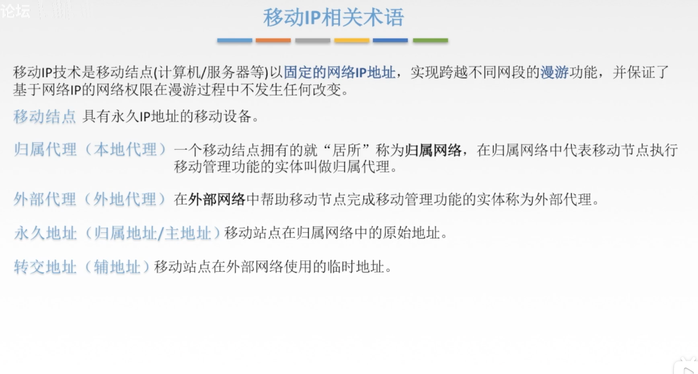
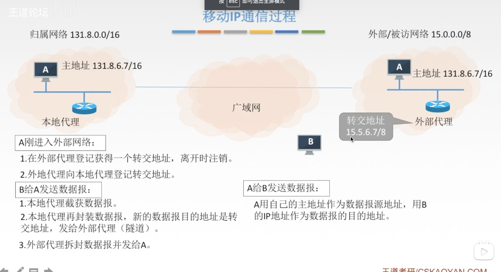
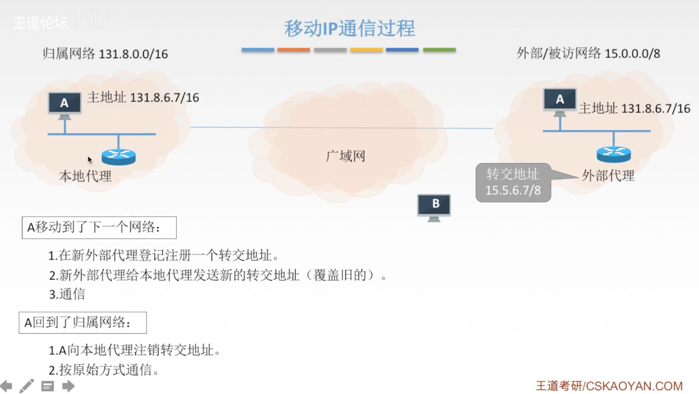
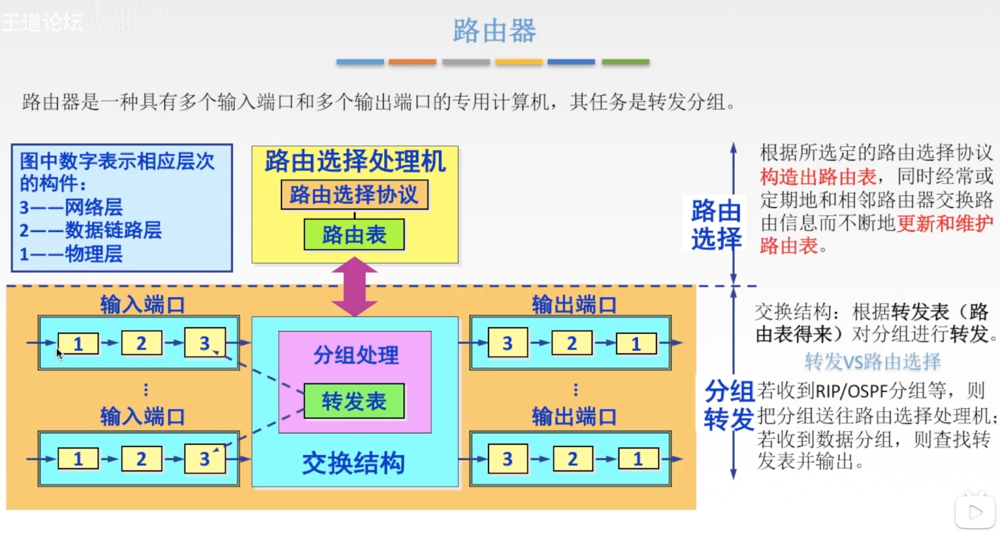
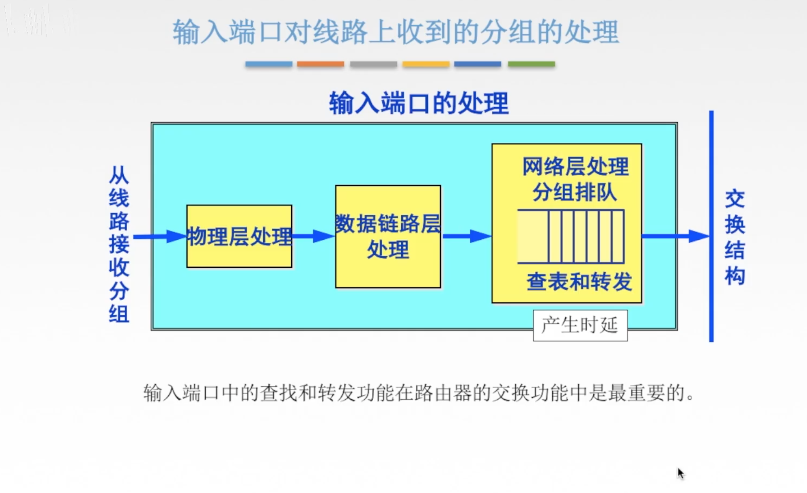
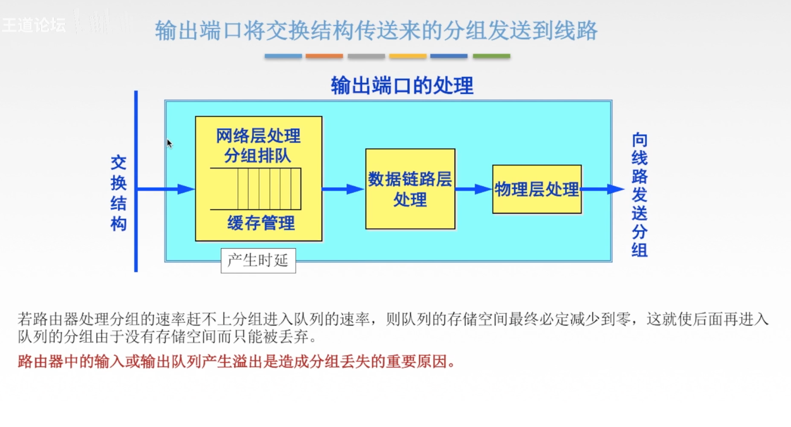
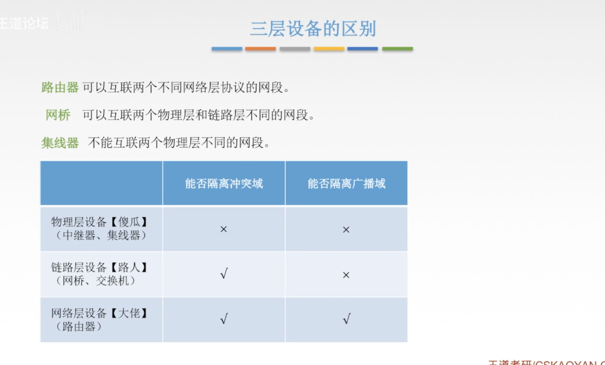
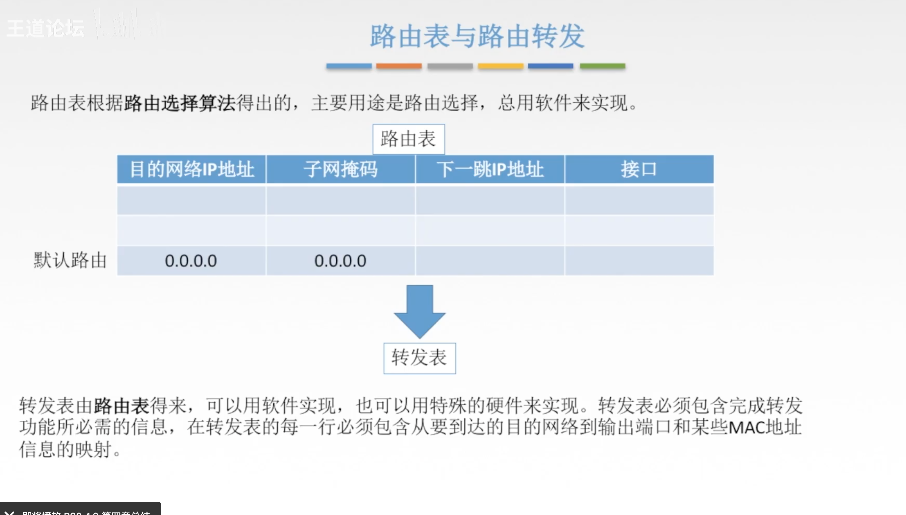
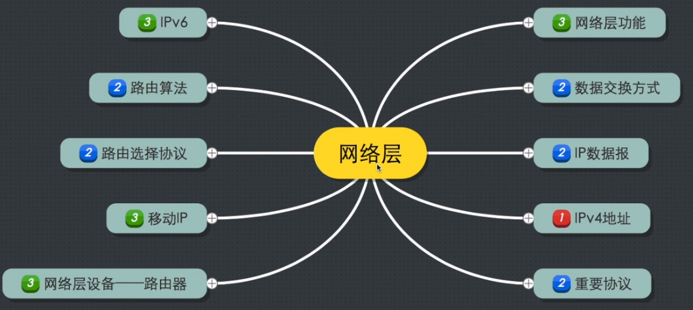

[TOC]

## 移动IP

### 移动IP相关术语

移动IP技术是移动结点（计算机/服务器等）以固定的网络IP地址，实现跨越不同网段的漫游功能，并保证了基于网络IP的网络权限在漫游过程中不发生任何改变

移动结点：具有永久IP地址的移动设备

归属代理（本地代理）：一个移动结点最开始的“居所”，在归属网络中代表移动节点执行移动管理功能的实体叫做归属代理

外部代理（外地代理）：在外部网络中帮助移动节点完成移动管理功能的实体称为外部代理

永久地址：移动站点在归属网络中的原始地址

转交地址：移动站点在外部网络使用的临时地址

### 移动IP的通信过程

主机A本身就有一个主地址（也可以叫做永久地址）

当主机A刚进入外部网络时：
主机A会在外部代理登记获得一个转交地址，离开时注销

外部代理向本地代理登记转交地址（其实就是告诉主机A的本地代理它去哪了）

当主机B给A发送数据报时：
要是主机A在归属网络内，那么直接交付

如果主机A在外部网络内，那么本地代理就会截获数据报

本地代理会对数据报进行再一次封装，新的数据报目的地址是转交地址，发给外部代理

外部代理收到之后拆封数据报然后根据对应的MAC地址发给主机A（主机A在外部代理登记时就会把自己MAC地址告诉外部代理）

当主机A给B发送数据报：

A用自己的主地址作为数据报源地址，用B的IP地址作为数据报的目的地址

### 移动IP通信过程

## 网络层设备

### 路由器

如果路由器收到的是RIP或者OSPF分组等，就会把分组送往路由选择处理机（分组是为了交换路由信息）

如果路由器收到的是数据分组，那么就要发往交换结构处，然后根据转发表找出对应输出端口进行转发

### 输入端口

### 输出端口

### 三层设备的区别

### 路由表与路由转发

转发表是根据路由表得来的

路由表是路由器根据路由选择协议，通过交换不同路由器之间的信息得来的。路由表的基本要素是目的网络IP地址，子网掩码，下一跳IP地址。接口并不是所有路由表都有

路由表一般仅包含从目的网络到下一跳的映射

转发表是从路由表得出的。转发表必须包含完成转发功能所必需的信息。也就是说，在转发表的每一行必须包含从要到达的目的网络到输出端口和某些MAC地址信息（如下一跳的以太网地址）的映射

## 网络层总结🌟

